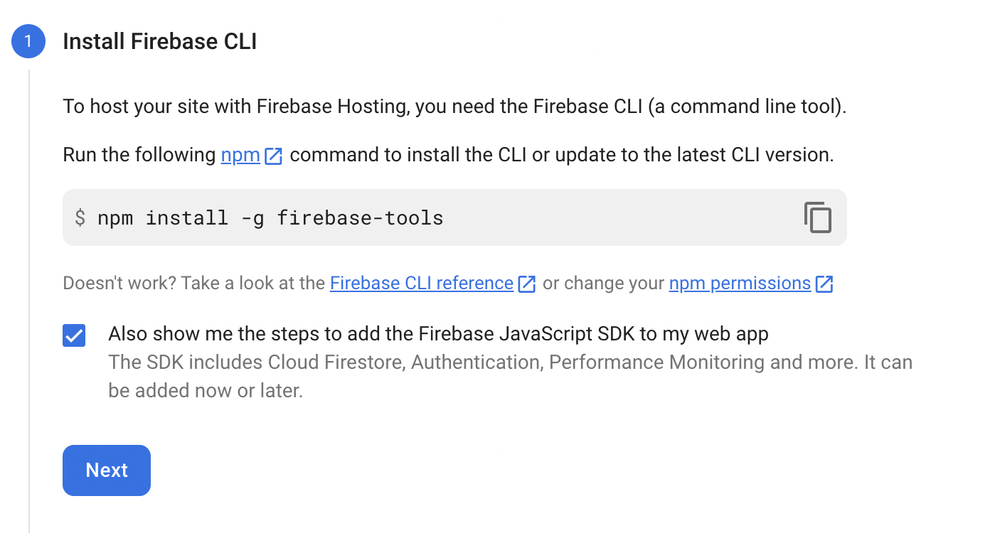
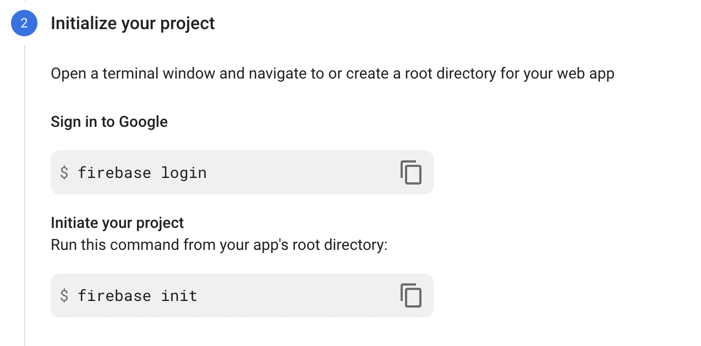
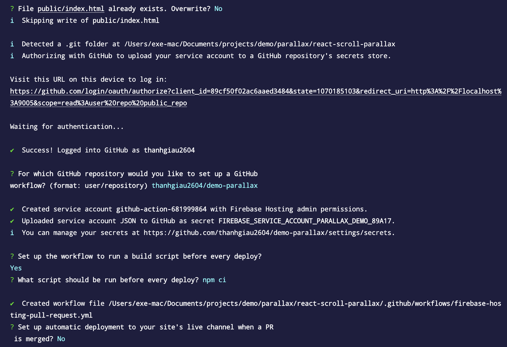
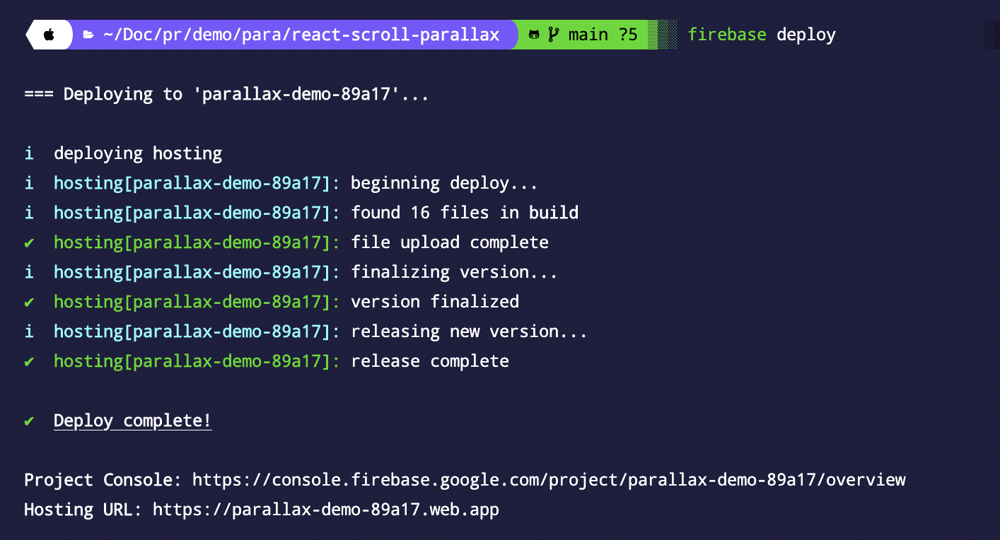

## FIREBASE HOSTING

1. Create `Firebase` project
2. Setup Firebase hosting
`npm install -g firebase-tools`

Khi run `firebase init`, chúng ta sẽ lựa chọn 1 số option để tạo config, đại loại sẽ lựa chọn 1 số option như sau:
- Firebase feature sử dụng trong project.
- Folder mà chúng ta public (nếu react-app thì ta dùng folder `build`)
- Nếu config `workflow github action` cần phải cấp quyền Github repository và một số thông tin khác

`yarn build` để build website của bạn (CRA) → folder `build` được tạo ra.
Sau đó run `firebase deploy` để tiến hành quá trình deploy.
Chỉ tầm khoảng 10s, việc deployment sẽ hoàn tất.
Kết quả như sau:
