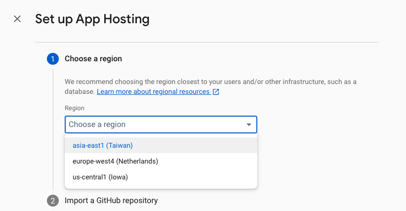
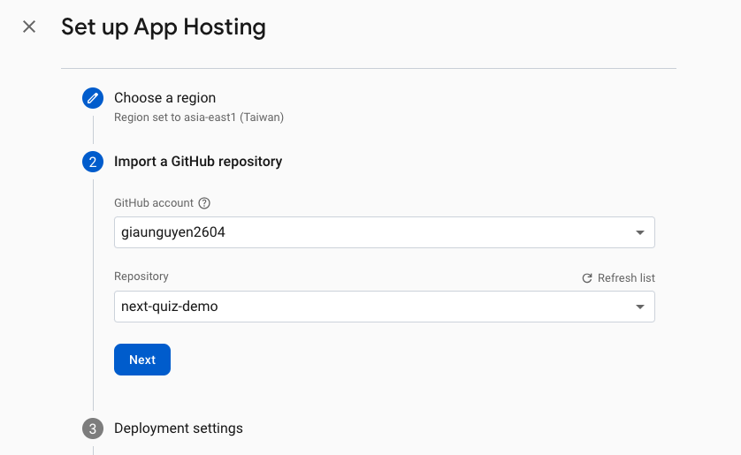
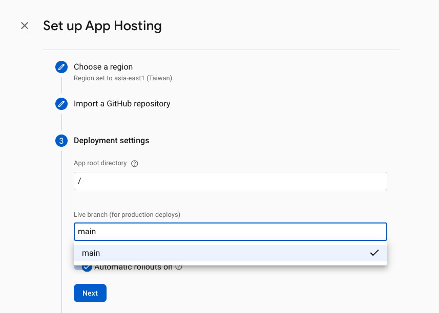
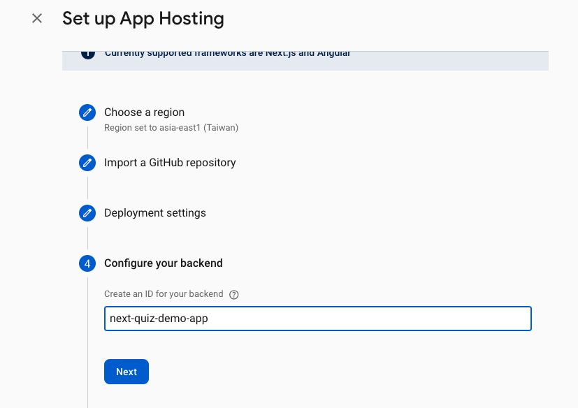
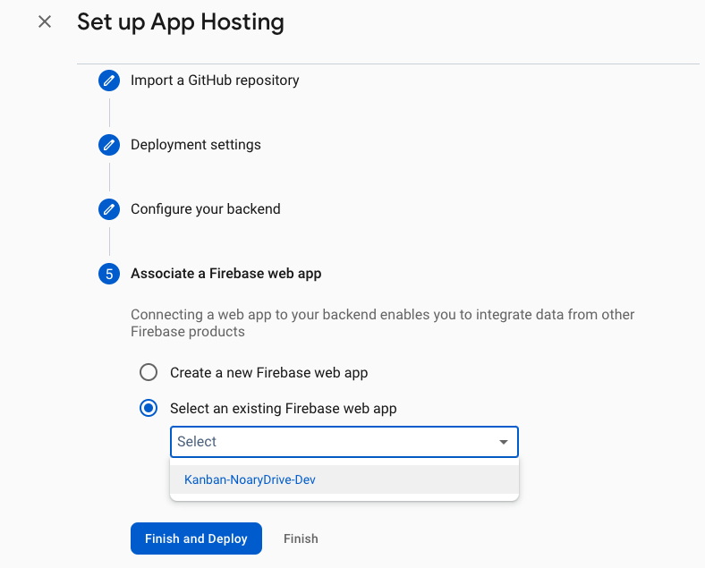

# How to deploy NextJS Application to Firebase using Firebase Hosting

## Before you begin

- Create a Firebase project in the Firebase Console.
- Upgrade the billing plan for the project to use Firebase Hosting.
- Set up a Next.js project (version 13.4.7 or below).

## Steps to Set Up App Hosting

### 1. Choose a region



### 2. Import a GitHub repository



### 3. Deployment settings



### 4. Configure your backend



### 5. Associate a Firebase web app



## Configure and manage App Hosting backends

Reference: [Link](https://firebase.google.com/docs/app-hosting/configure)

App Hosting provides tools to manage and configure backends based on your specific needs.

To set information such as environment variables, concurrency, CPU, and memory limits,... create and edit the `apphosting.yaml` file in your app's root directory.

To create `apphosting.yaml`, run:

```bash
firebase init apphosting
```

Example `apphosting.yaml` file:

```yaml
# Settings for Cloud Run
runConfig:
  minInstances: 2
  maxInstances: 100
  concurrency: 100
  cpu: 2
  memoryMiB: 1024

# Environment variables and secrets
env:
  - variable: STORAGE_BUCKET
    value: mybucket.firebasestorage.app
    availability:
      - BUILD
      - RUNTIME

  - variable: API_KEY
    secret: myApiKeySecret

    # Same as API_KEY above but with a pinned version.
  - variable: PINNED_API_KEY
    secret: myApiKeySecret@5

    # Same as API_KEY above but with the long form secret reference as defined by Cloud Secret Manager.
  - variable: VERBOSE_API_KEY
    secret: projects/test-project/secrets/secretID

    # Same as API_KEY above but with the long form secret reference with pinned version.
  - variable: PINNED_VERBOSE_API_KEY
    secret: projects/test-project/secrets/secretID/versions/5
```

**Notes:**

- Valid environment variable keys are comprised of A-Z characters or underscores.
- Don't use any of these keys in your configuration files:
  - Any variable beginning with X_FIREBASE_
  - PORT
  - K_SERVICE
  - K_REVISION
  - K_CONFIGURATION
- You can create secrets with the CLI command `firebase apphosting:secrets:set`.
- To fully use Cloud Secret Manager, use the Cloud Secret Manager console and grant your App Hosting backend permissions with the CLI command: `firebase apphosting:secrets:grantaccess`.

## Deploy thoughout CLI

Reference: [Link](https://firebase.google.com/docs/hosting/frameworks/nextjs)

- Using the Firebase CLI, you can deploy your Next.js Web apps to Firebase and serve them with Firebase Hosting.
- If your app includes dynamic server-side logic, the CLI deploys that logic to Cloud Functions for Firebase.
- The latest supported Next.js version is 13.4.7.

### Before you begin

- Firebase CLI version 12.1.0 or later.
- Optional: Billing enabled on your Firebase project (required if you plan to use SSR)
- Optional: use the experimental ReactFire library to benefit from its Firebase-friendly features

### Initialize Firebase

- In the Firebase CLI, enable the web frameworks preview:

```bash
firebase experiments:enable webframeworks
```

- Run the initialization command from the CLI

```bash
firebase init hosting
```

then follow the prompts

After finished Initialize, run `firebase deploy` to deploy the App.

**Notes:**

- The Firebase CLI will detect usage of getServerSideProps. It will deploy functions to Cloud Functions for Firebase to run dynamic server code.
