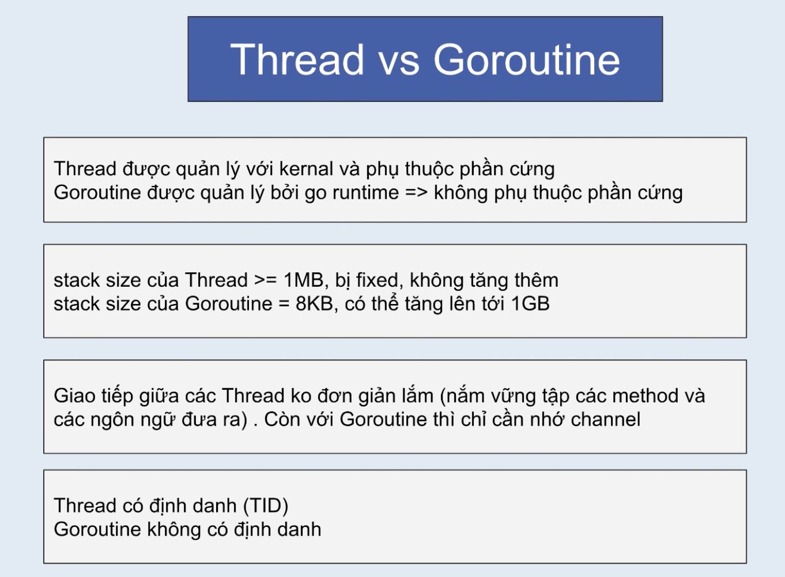
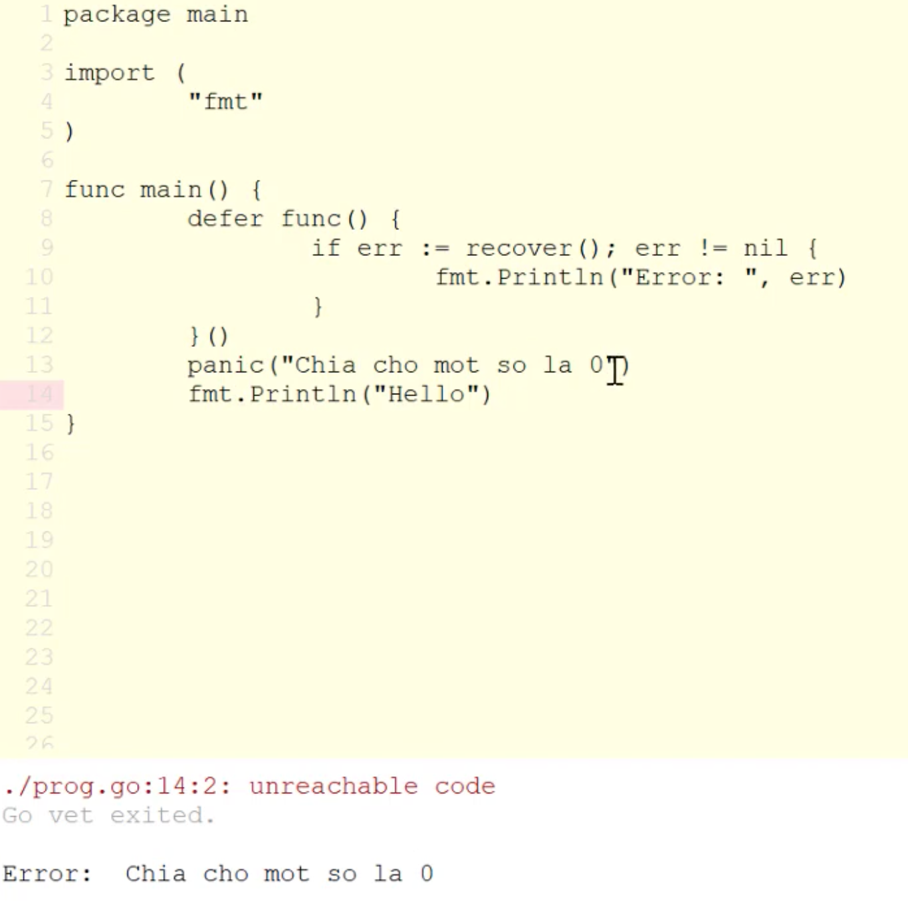
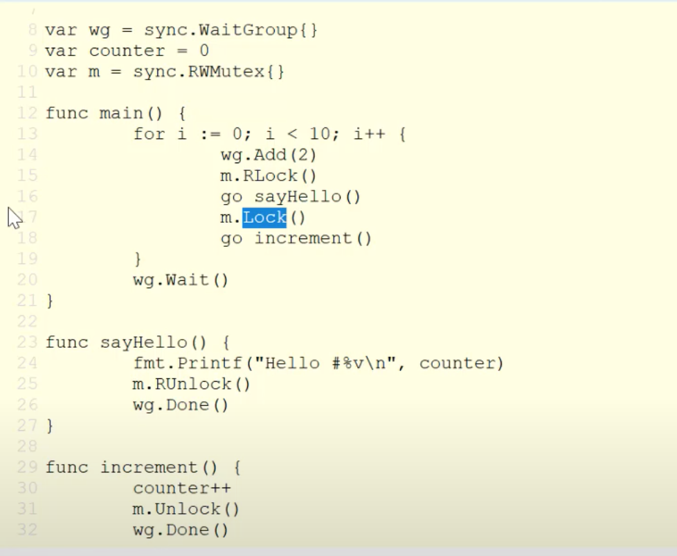
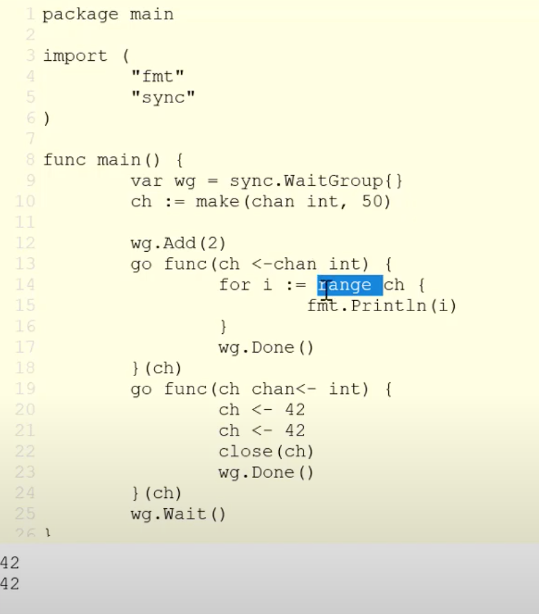
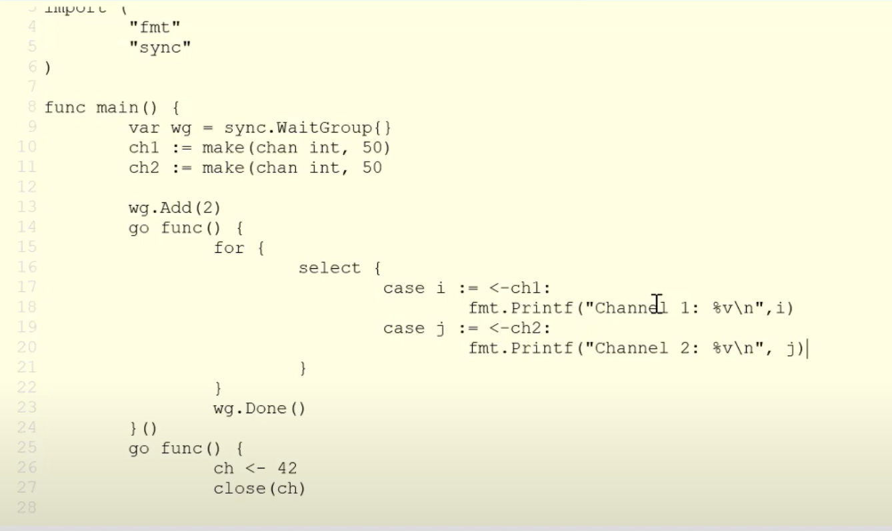

## GOLANG

#### 1. Variables

Cú pháp:

```go
var tenbien kieudulieu = giatrikhoitao
```

Example:

```go
package main
import "fmt"
func main() {
  var number int
  number = 10
  fmt.println(number)
  var number1 int = 11
  fmt.println(number1)
}
```

Result

```go
10
11
```

Type Inference

```go
var email = 'abcd@gmail.com'
```

Go sẽ ngầm hiểu là kiểu string

**Khai báo nhiều biến:**

1. Khai báo nhiều biến cùng kiểu dữ liệu

   ```go
   var a, b int
   a = 1
   b = 2
   var a1, b1 int = 10, 11
   // có thể không cần kiểu dữ liệu
   var a2, b2 = 10, 11
   ```

2. Khai báo nhiều biến khác kiểu dữ liệu

   ```go
   var (
     name string
     address string
     age int
   )
    name = "Robin"
    address = "Viet nam"
    age = 2020

    // có thể khởi tạo luôn giá trị
    var (
      name string = "Example"
      age int = 10
    )

    //Có thể không khai báo kiểu dữ liệu

    var name2, address2, age2 = "name2", "address2", 15

    // short way: thông dụng
    language := "Golang"

   ```

#### 3. Kiểu dữ liệu và hằng số

```go
  package main
  func main() {
    //Kiểu bool
    var myBool bool = true
    // Kiểu string
    var myString string  = "hello"
    // Kiểu int
    var myInt int = 123
    // int 8, 16, 32, 64
    // 1. Range 2. Bits
    // About range
    fmt.Println(math.MinInt8) // -128
    fmt.Println(math.MaxInt8) // 127
    // 16: Min = -32768; Max=32767
    // About bits
    fmt.Println(bits.OnesCount8(math.MaxUnit8)) //8
    fmt.Println(bits.OnesCount16(math.MaxUnit16)) //16
    fmt.Println(bits.OnesCount32(math.MaxUnit32)) //32
    fmt.Println(bits.OnesCount64(math.MaxUnit64)) //64

    //unit
  var myUint uint = -10 //error

  var myByte byte = 1
  fmt.Println(myByte)
  fmt.Printf("%T", myByte) //uint8

  var a byte = "A"
  fmt.Println(a) // 65

  //float
  var myFloat float64 = 10.01
  //complex z = a + bi
  var z complex64 = 10+1i

  // Rune
  var myString string = "Nhẫn"
  runes := []rune(myString)

  for i:= 0; i< len(runes); i++{
    fmt.Printf("%c", runes[i])

  }


  //Zero value (default value if not defined)
  // 0 for numeric, false for boolean, '' for string type


  //
  }
```

Dữ liệu nghiêm ngặt

```go
  var a int = 1
  var b float64 = 1.5
  fmt.Println(a+b) // error
  fmt.Println(float64(a)+b) // right
```

Const (hằng số)

```go
  const PI = 3.14
  fmt.Println(PI)
```

#### 4. Câu lệnh điều khiển

if else

```go
  number := 10
  if number == 10 {
    fmt.Println("number = 10")
  }
```

if statement; condition {  }

```go
  if a:=100; a>100 {
    fmt.Println("a > 100")
  } else {
    fmt.Println("a = 100")
  }
```

switch - case

```go
  number := 10
  switch number {
    case 1:
      fmt.Println("number = 1")
    case 2:
      fmt.Println("number = 2")
    case 3, 4, 5:
      fmt.Println("number = 3, 4 or 5" )
    ...
    default :
      fmt.Println("unknown")
  }


  switch number {
    case number > 10
      fmt.Println("number > 10")
    case number == 10
      fmt.Println("number = 10")
    default :
      fmt.Println("unknown")
  }
```

//FallThrough: không dừng switch case

```go
switch number {
    case 1
      fmt.Println("number = 1")
      fallthrough
    case 10
      fmt.Println("number = 10")
      fallthrough
    case 2
      fmt.Println("number = 2")
      fallthrough
    case 3
      fmt.Println("number = 3")
  }
```

result

```go
number = 10
number = 2
number = 3
```

//break, goto

```go
  switch number {
    case 1
      fmt.Println("number = 1")
      fallthrough
    case 10
      if (number == 10){
        fmt.Println("Break here")
        break
      }
      fmt.Println("number = 10")
      fallthrough
    case 2
      fmt.Println("number = 2")
      fallthrough
    case 3
      fmt.Println("number = 3")
  }
```

Bỏ qua Goto

Câu lệnh lặp

```go
for init; condition; post
for i:= 10; i<10; i++ {
  fmt.Println(i)
}
```

//break and continue as `pascal` in for loop

```go
  j:=0
  for j<10; {
    fmt.Println(j)
    j++
  }
```

//infinite loop

```c
for {
  fmt.Println("....")
}
```

//multiple init; condition; post

```go
  for i,j := 1, 2; i<10 && j<10; i, j = i+1, j+1 {
    fmt.Println(i)
    fmt.Println(j)
  }
```

#### 5. Hàm

```go
  func func_name (params) return_type {
    // something
  }
```

Example:

```go
  package main
  import "fmt"
  func Chao() {
    fmt.Println("Hello")
  }
  func sayHello(name string ) {
    fmt.Println("Hello ", name)
  }

  func greeting(name string ) string  {
    result := fmt.Sprintf("Hello %s", name)
    return result
  }

//multiple return values
  func rectInfo(w, h int)(int, int){
    return w, h
  }

//named return valueses
  func rectInfo(w, h int)(width int, height int, isSquare bool) {
    isSquare = w == h
    return w, h, isSquare
  }

  func main() {
    Chao()
    sayHello("An")
    result := greeting("Ryan")
    fmt.Println(result)

    //
    w, h, isSquare := redctInfo(100, 200)

  }
```

#### 6. Workspace 1

Create 2 files

- main.go && helper.go
- call func in helper.go at main.go
- typing cmd: go run \*.go to execute

Create folder helper, move helper.go inside it
Full code
main.go

```go
  package main
  import stringHelper "projectname/helper"
// or import "projectname/helper"
  func main() {
    stringHelper.SayHello()
    // or helper.SayHello()
  }
```

helper/helper.go

```go
  package helper
  import "fmt"

  func SayHello(){

  }

  // sayHello: private
```

config GOPATH
cmd typing

```go
export GOPATH=...
```

#### 6. Workspace 2

- cd to project and typing `go install` &#8594; generate `bin` folder
- `pkg` folder  chứa file `*.a` dùng để đóng gói các package
- Khi import `pkg` thì chỉ cần import package name
-

#### 6. Cấu trúc mảng Array

Khai báo:

```go
var myArray [4] int
```

default value is 0
Gán giá trị cho array

```go
myArray[0] = 123
```

Vừa khai báo vừa khởi tạo giá trị

```go
array := [3] int {1,2,3}
```

Size mảng

```go
fmt.Println(len(myArray))
```

Khai báo mảng không cần set size

```go
array := [...]string {"Vinfast","Honda"}
=> using [...]
```

_array là value type không là reference type_

```go
countries := [...]string {"VN", "US", "FRANCE"}
copyCountries := countries
copyCountries[0] = "CANADA"
```

Khác với các ngôn ngữ lập trình khác, thì khi thay đổi copyCountries thì countries không bị ảnh hưởng

**Loop Array**

```go
for i:=0; i<len(countries); i++ {
  fmt.Println(countries[i)
}
```

Cách 2:

```go
for index, value := range countries {
  fmt.Println("i=%d value=%s", index, value)
  fmt.Println
}
```

if no need `index` or `value`, insert `_` at that position

`blank identifier = _`

Mảng 2 chiều

```go
matrix := [4][2] int {
  {1,2},
  {3,4},
  {5,6},
  {7,8}
}
fmt.Println(matrix)

for i:=0; i<4; i++{
  for j:=0; j<2; j++ {
    fmt.Print(matrix[i][j])
  }
  fmt.Println()
}
```

#### 7. Tìm hiểu về Slice

_Khai báo slice:_

```go
  var slice []int
  fmt.Println(slice)
```

_Khai báo và khởi tạo giá trị cho Slice_

```go
var slice1 = []int {1,2,3,4}
fmt.Println(slice1)
```

_Tạo 1 slice từ 1 Array_

```go
var arrray = [4]int {1,2,3,4}
slice2 := array[1:3] //array[1] --> array[2]
slice3 := array[:] // all
slice4 := array[2:] //from 2 to end
slice5 := array[:3] //from 0 to 2
```

_Tạo 1 slice từ 1 slice khác_

```go
var slice6 = []int {1,2,3,4,5,6,7,8,9}
slice7 := slice6 //slice7 = slice6
slice8 := slice6[1:]
```

`slice &#8594; reference type`, example below:

```go
var array1 = [5]int {1,2,3,4,5}
slice9 := array1[:]
slice9[0] = 777
//array will change with array1[0]=777
```

_Length & capacity cua Slice_

- len: số lượng phân tử slice
- cap: số lượng phần tử của underlying array bắt đầu từ start khi slice được tạo

```go
countries := [...]string {"VN", "USA", "CANADA", "FRANCE", "CHINA"}
slice10 := countries[2:3] // CANADA
fmt.Println(len(slice10)) // =1
fmt.Println(cap(slice10)) // =3 (index start=2, from 2 to end in array countries have 3 elements)
```

Một số hàm thường sử dụng

- make:
  ```go
  slice11 := make([]int, 2, 5)
  fmt.Println(slice11) // [0,0]
  fmt.Println(len(slice11)) // 2
  fmt.Println(cap(slice11)) //5
  //if not cap params, cap = len
  ```
- append
  ```go
  var slice13 []int
  slice13 = append(slice13,100)
  fmt.Println(slice13) // [100]
  // Có thể truyền vào vô số param trong hàm slice
  slice = append(slice, 1,2,3,4,5,6)
  ```
- copy

  ```go
  src := []string {"A", "B", "C", "D"}
  dest := make([]string,2)
  number := copy(dest,src)
  fmt.Println(number) // 2
  fmt.Println(dest) // ["A","B"]


  //delete item with index =1
  src = append(src[:1], src[2:])
  ```

- Cơ chế grow slice:
  - cap: được hiểu là bộ nhớ mở rộng để chuẩn bị sẵn cho việc thêm phần tử vào slice
  - Nếu khi thêm phần tử vào slice mà số lượng phần tử lớn hơn cap thì cơ chế grow slice sẽ diễn ra theo nguyên tắc double cap ban đầu. Nếu cap vượt 1024 thì sẽ được tính theo công thức `newcap += newcap / 4`

#### 8. Variadic Functions

Có thể truyền vào vô số tham số

```go
package main

func addItem(item int, list ...int){
  // 100, 200, 300, 400 -> int[] {100,200,300,400}
  list = append(list, item)
  fmt.Println(list)
}

func change(list ...int){
  list[0] = 999
}

func main(){
  addItem(1, 100, 200, 300, 400)

  var list = []int {1,2,3,4}
  //truyền slice vào function
  addItem(100, list...)

  change(list...)

  fmt.Println(list) // [999,2,3,4]
}
```

#### 9. Cấu trúc dữ liệu map

```go
package main

import "fmt"

func main() {
  var myMap =make(map[string]int)

  fmt.Println(myMap)

  var myMap1 map[string]int
  fmt.Println(myMap1)

  //myMap != nil, myMap1 = nil

  //Khai báo với giá trị khởi tạo
  myMap2 := map[string]int {
    "key1" : 1,
    "key2" : 2,
    "key3" : 3
  } // map[key1:1 key2:2 key3: 3]

  // thêm 1 phần tử vào map
  myMap2["key4"] = 4
  myMap2["key5"] = 5

  //delete 1 phần tử trong map = delete(map, key)
  delete(myMap2, "key1")

  //len của map
  fmt.Println(len(myMap2))

  //Map là reference type
  myMap3 := myMap2
  myMap3["key5"] = 1000// myMap2 will change at key5

  //truy cập 1 phần tử trong map
  value, found := myMap2["key1"]
  if found {
    fmt.Println(value)
  } else {
    fmt.Println("Not found");
  }

  //Trong map không có toán tử ==
  if (myMap2 == myMap3){ //error

  }
}
```

#### 10. Con trỏ

```go
package main

func main() {
  a := 100
  var pointer *int

  pointer = &a

  fmt.Println(pointer)
  fmt.Printf("%T", pointer)

  p2 := new(int) //<=> var p2 *int

  //zero value
  var pointer *int
  fmt.Println(pointer) // nil
  pointer2 = new(int) // not nil

  a := 100
  pointer = &a
  *pointer = 999 //will change value of a

  //demo poiner -> array
  array := [3]{1,2,3}
  var poiner *[3]int
  pointer = &array
  fmt.Println(pointer) // &[1,2,3,4]
  fmt.Printf("%T", pointer) // *[4]int

  c := 30
  var pointer2 *int  = &c
  applyPointer(pointer2)
   fmt.Println(c)// c=777
}
func applyPointer (pointer *int){
  *pointer = 777
}
```

#### 11. Struct

```go
package main
import "fmt"

type Student struct {
  id int
  name string
}

func main(){
  // 1. named
  st1 := Student {
    id:123,
    name: "Ryan", //end by ,
  }

  fmt.Println(st1.id)
  fmt.Println(st1.name)
  //2
  st2 := Student{ 456, "Robin"}
  //3
  var st3 Student = struct {
    id int
    naem string
  }{
    id: 777,
    name: "Bill",
  }
  // anonymous struct
  var anomymous = struct {
    email string
    age int
  }{"ryan@gmail.com", 27,}

  // pointer trỏ tới struct
  pointer := &Student {
    999,
    "Robin"
  }
  fmt.Println((*pointer).id) //get field id
  //or short way: fmt.Println(pointer.id)
  
  // anonymous fields
  type NoName struct {
    string
    int
  }

  n := NoName{"abcd", 10}
}
```

struct lồng struct - Nested struct
```go
type StudentInfo struct {
  class string
  email string
  age int
}

type Student struct {
  id int
  name stirng
  info StudentInfo
}

func main(){

  student := Student {
    id: 123,
    name: "Ryan",
    info: StudentInfo {
      class: "ql091",
      email: "ryan@gmail.com",
      age: 27
    }
  }

  st2 := Student{
    456,
    "Robin",
    StudentInfo {
      class: "",
      email: "",
      age: 20
    }
  }

  //compare 2 struct 

  type struct1 struct {
    id
    string
  }

  s1 := struct1{1, "A"}
  s2 := struct1{1, "A"}

  if s1 == s2 {
    fmt.Println("s1 == s2")
  } else {
    fmt.Println("s1 != s2")
  } // s1 == s2
  
  //only compare 2 struct when all fields can compare, example type `map` in Golang can't compare
  //should use named struct
}
```

Zero value of struct: is zero value of each field in struct, example `int` --> 0, `string` --> ''


#### 12. Method in Golang
```go
type Student struct {
  string
}

//Define method
func (s Student) getname() string {
  return s.name
}

func main(){
  student := Student{"Ryan"}

  name := student.getName()

  fmt.Println(name)
}
```
**Cú pháp:**
```go
func (t Type) methodName(params) returns {
  //body code
}
// (t Type) => Reciver
```
**1. Value Receiver**
```go
func (s Student) changeName() string {
  s.name = "Robin"
}

func main(){
  student := Student{"Ryan"}
  student.changeName()
  fmt.Println(student.name) // -> "Ryan": not change
}))
```
--> 2 addresses are different

**2. Pointer Receiver**
```go
func (s *Student) changeName2() string {
  s.name = "Robin"
}

func main() {
  student := Student{"Ryan"}
  student.changeName2()
  fmt.Println(student.name)  // -> "Robin": changed
}
```
**Non struct**
```go
type String string

func (s String) append(str string) string {
  retrun fmt.Sprintf("%s%s", s, str)
}

func main(){
  s1 := String("a")
  newStr := s1.append("b")
  fmt.Println(newStr) // -> ab
}
```

#### 13. Interface
```go
package main

//interface & multiple interface
type Animal interface {
  speak()
}
type Movement interface {
  move()
}

type Dog struct {}

func (d Dog) speak() {
  fmt.Println("woaww woaww")
}

func (d Dog) move() {
  fmt.Println("Chay bang 4 chan")
}

func main(){
  dog := Dog{}

  var m Movement = dog
  m.move()

  var a Animal = dog
  a.speak()
}
```

**Embed interface**

```go
type Movement interface {
  move()
}

type Animal interface {
  speak()
}

type NextAnimal interface {
  Movement
  Animal
}

func main(){
  dog := Dog{}
  var na NextAnimal = dog
  na.speak()
  na.move()
}
```
**Empty interface **
```go

type data struct {
  index int
}

func goOut(i interface{}){
  fmt.Println(i)
}

func main(){
  goOut(10) // -> 10
  goOut(10.1) // -> 10.1
  d := data{123}
  goOut(d) // -> {123}
}
```
Empty interface có thể nhận vào bất kì kiểu dữ liệu. VD: hàm fmt.Println

#### 14. Concerency
>Là khả năng 1 chương trình có thể điều khối nhiều tác vụ trng cùng một khoảng thời gian và trong quá trình điều phối chỉ cho phép 1 tác vụ chạy trong 1 thời điểm

**Cách làm truyền thống:**
Dowloading --> Buffering --> Rendering
--> Hiệu suất thấp
Tại sao cần Concurrency:
- Tận dụng tối đa CPU (1 core or >= 2 cores)
- Tăng tính phản hồi của ứng dụng
  
**Parallelism là gì?**
>Là khả năng 1 chương trình có thể thực thi 2 hoặc nhiều tasks trong cùng 1 thời điểm, với điều kiện CPU phải có từ 2 core trở lên
-> doing lots of things at once

**Thread & Process**
**Go routines && Channel**




**Defer function**
> Defer statements delay the execution of the function or method or an anonymous method until the nearby functions returns.

-Multiple defer statements are allowed in the same program and they are executed in LIFO(Last-In, First-Out)
-Defer statements are generally used to ensure that the files are closed when their need is over, or to close the channel, or to catch the panics in the program.
Example
```go
// Go program to illustrate the
// concept of the defer statement
package main
 
import "fmt"
// Functions
func mul(a1, a2 int) int {
    res := a1 * a2
    fmt.Println("Result: ", res)
    return 0
}
 
func show() {
    fmt.Println("Hello!, GeeksforGeeks")
}
// Main function
func main() {
 
    // Calling mul() function
    // Here mul function behaves
    // like a normal function
    mul(23, 45)
 
    // Calling mul()function
    // Using defer keyword
    // Here the mul() function
    // is defer function
    defer mul(23, 56)
 
    // Calling show() function
    show()
}
```

```
Result:  1035
Hello!, GeeksforGeeks
Result:  1288
```

 
**Bổ sung kiến thức**
>Nếu TestType ở trên là một interface bạn có thể sử dụng tính năng `type assertion` để kiểm tra kiểu dữ liệu của một giá trị cho trước:
```go
package main

import (
    "fmt"
)

func main() {
    type TestType interface{}
    var testVal TestType = "Hello World"

    val, ok := testVal.(string)
    if !ok {
        fmt.Printf("Lỗi! Không thể chuyển đổi sang string.")
    }
    fmt.Printf("val: %v", val)

}
```
```go
Hiển thị:
val: Hello World
```
Lưu ý rắng bạn chỉ có thể sử dụng type assertion với giá trị thuộc kiểu interface.


**ENUM**
```go
const (
  red = iota
  yellow
  blue
  green
)

// red = 0; yellow =1; blue=2; green=3;
```

**panic**: lỗi không mong muôn trong quá trình thực hiện chương trình.
VD: Xảy ra khi gọi API, đọc dữ liệu từ file
Chương trình gặp panic sẽ dừng, nhưng trước khi dừng sẽ gọi thực thi tất cả defer function



**Go routine:**

- Default go routine `main`

- Khi go routine `main` kết thúc thì dừng luôn chương trình.
```go
go func()
```
Sử dụng Wait Group để chờ go routine chạy xong mới dừng chương trình
```go
package main
import {
  "fmt"
  "time"
  "sync"
}

func main(){
  var wg = sync.WaitGroup{}
  wg.Add(1) // wait 1 go routine

  go func(){
    count("Sheep")
    wg.Done()
  }()
  wg.Wait()
}

func count(name string){
  for i:=1; i<=5; i++{
    fmt.Println(name,i)
    time.Sleep(time.Second)
  }
}
```

Go routine chạy đồng bộ -> Mutex


Channel




