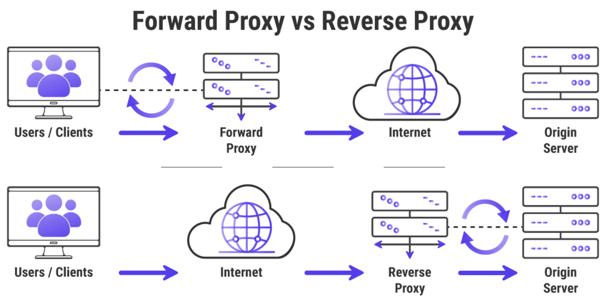

### 1. Javascript closure là gì? <a name='closure'></a>

> Closure một chức năng có quyền truy cập vào phạm vi cha, ngay cả sau khi phạm vi đã đóng.

VD: 1

```js
function speak() {
  var words = "hi";
  return function logIt() {
    console.log(words);
  };
}

const hello = speak();
hello(); // 'hi'
```

Ở ví dụ trên, ta thấy function logIt vẫn truy cập được giá trị `words = 'hi'` ngay cả khi scope của function speak đã đóng.

VD 2:

```js
function name(n) {
  return function (a) {
    return `${n} likes ${a}`;
  };
}

var j = name("John");
var c = name("Cindy");

j("dogs"); // 'John likes dogs'
c("cats"); // 'Cindy likes cats'
```

VD 3:

```js
function f1() {
  var N = 0; // N luon duoc khoi tao khoi ham f1 dduowcj thuc thi
  console.log(N);
  function f2() {
    // Ham f2
    N += 1; // cong don cho bien N
    console.log("-->>", N);
  }

  return f2;
}

var result = f1();

result(); // Chay lan 1  --> 1
result(); // Chay lan 2 --> 2
result(); // Chay lan 3 ---> 3
```

### 2. Javascript: Currying In JavaScript <a name='currying'></a>

> Currying is a technique of evaluating function with multiple arguments, into sequence of functions with single argument. In other words, when a function, instead of taking all arguments at one time, takes the first one and return a new function that takes the second one and returns a new function which takes the third one, and so forth, until all arguments have been fulfilled.

```js
const movies = [
  {
    id: 1,
    name: "Matrix",
  },
  {
    id: 2,
    name: "Star Wars",
  },
  {
    id: 3,
    name: "The wolf of Wall Street",
  },
];

const series = [
  {
    id: 4,
    name: "South Park",
  },
  {
    id: 5,
    name: "The Simpsons",
  },
  {
    id: 6,
    name: "The Big Bang Theory",
  },
];

//Không tốt
console.log(series.map((serie) => serie.id)); //should return [ 1, 2, 3 ])

console.log(movies.map((movie) => movie.id)); //should return [ 1, 2, 3 ])

//Tốt
const get = (property) => (object) => object[property];

const getId = get("id"); // if need get name then get('name')

console.log(movies.map(getId)); //should return [ 1, 2, 3 ]
console.log(series.map(getId)); //should return [ 4, 5, 6 ]
```

### 3. Merge array <a name='currying'></a>

- Concat es5:

```js
var array1 = [1, 2];
var array2 = [3, 4, 5];
var array3 = array1.concat(array2); // returns a new array
/*
Output:
[1, 2, 3, 4, 5]
*/

Với concat multiple array javascript

var array1 = [1, 2];
var array2 = [3, 4, 5];
var array3 = [6,7,8]
var array4 = array1.concat(array2, array3); // returns a new array
/*
Output:
[1, 2, 3, 4, 5, 6, 7, 8]
*/
```

- Es6

```js
# Với 2 arrays:

var array1 = [1, 2];
var array2 = [3, 4, 5];
var array3 = [...array1, ...array2]; // returns a new array
/*
Output:
[1, 2, 3, 4, 5]
*/
 # Multiple Arrays

var array1 = [1, 2];
var array2 = [3, 4, 5];
var array3 = [6,7,8]
var arrConc = [...array1, ...array2, ...array3]
/*
Output:
[1, 2, 3, 4, 5, 6, 7, 8]
*/
 or chúng ta cũng có thể làm như sau và sẽ thay đổi giá trị array ban đầu

array1.push(...array2, ...array3);//
//Lúc này array1 sẽ có giá trị là [1, 2, 3, 4, 5, 6, 7, 8]
```

- Merge array Object

```js
var arr1 = [
  { name: "lang", value: "English" },
  { name: "age", value: "18" },
];
var arr2 = [
  { name: "childs", value: "5" },
  { name: "lang", value: "German" },
];

Array.prototype.push.apply(arr1, arr2);
console.log(arr1);

Output: [
  { name: "lang", value: "English" },
  { name: "age", value: "18" },
  { name: "childs", value: "5" },
  { name: "lang", value: "German" },
];
```

- Lấy item của array1 làm key, lấy item của array2 làm value.

```js
var columns = ["Date", "blog", "name", "Location", "rank"];
var rows = ["2019", "javascript", "anonystick", "Vietnam", "150000"];

var result = rows.reduce(function(result, field, index) {
 result[columns[index]] = field;
 return result;
}, {})
console.log(result);

Output:
{
Date: "2019",
blog: "javascript",
name: "anonystick",
Location: "Vietnam",
rank: "150000"
}
```

### 4. Forward Proxy & Reverse Proxy <a name='proxy'></a>

- Forward Proxy: thay mặt cho client
- Reverse Proxy: thay mặt cho server



### 5. Defer và async hiệu quả khi load javascript <a name='deferasync'></a>

- Cả async và defer đều là các thuộc tính boolean. Cách sử dụng của chúng là tương tự nhau:

```js
<script async src="script.js"></script>
<script defer src="script.js"></script>
```

Các attribute này chỉ có ý nghĩa khi sử dụng tập lệnh trong `<head>` của trang và chúng sẽ vô dụng nếu bạn đặt tập lệnh vào phần `</body>`

&#8594; Điều tốt nhất cần làm để tăng tốc độ tải trang của bạn khi sử dụng tập lệnh là đặt chúng vào thẻ `<head>` và thêm thuộc tính defer vào thẻ script của bạn:

```js
<script defer src="script.js"></script>
```

using `defer`:


### 6. Try catch <a name='trycatch'></a>

- try catch chỉ hoạt động (bắt lỗi) khi 1 function được gọi thực thi trong try
- Không hoạt động với hàm setTimeout (vì khi đó try catch đã chạy xong thì setTimeout mới chạy)

### 7. Xử lý relative imports với jsconfig <a name='import'></a>

- create file jsconfig.json in `root path` of project
- should know how to use include, exclude...
- example config:

```js
{
  "compilerOptions": {
    "module": "commonjs",
    "target": "es6",
    "baseUrl": "./src"
  },
  "include": [
    "src/**/*"
  ]
}
```

### 8. Create custom field using `formik` <a name='formik'></a>

- Source: <a href='https://github.com/paulnguyen-mn/redux-photo-app/pull/3/files'>Link code demo</a>

### 9. Swap 2 value <a name='swap'></a>

let a = 3
let b = 4
[a,b] = [b,a]

### 10. New feature in ES11/ES2020 <a name='es11'></a>

##### 10.1. Optional Chaining

As a JavaScript developer, you must have come across this error a thousand times.
TypeError: Cannot read property ‘z’ of undefined
&#8594; It happens because you tried to access a property on something that is not an object.

```js
const smartphones = {
  brands: {
    apple: true,
  },
};
console.log(smartphones.brands.apple); // output is: ‘true’

console.log(smartphones.companies.motorola); // output is: TypeError: Cannot read property 'motorola' of undefined
```

&#8594; `New feature`: using a question mark immediately followed by a dot (“?.”). It commands the JavaScript engine to not throw an error but return “undefined” as output.

Example:
**Accessing an Object**

```js
const smartphones = {
  brands: {
    apple: true,
  },
};
console.log(smartphones.companies?.motorola); // output is: undefined
```

**Accessing an Array**

```js
let smartphones = ["apple", "samsung", "motorola"];
console.log(smartphones[1]); // output is: samsung

smartphones = null;
console.log(smartphones[1]); // output is: TypeError: Cannot read property '1' of null

console.log(smartphones?.[1]); // output is: undefined
```

**Accessing a Function**

```js
let phoneApple = () => {
  return "11 Pro Max";
};

console.log(phoneApple()); // output is: 11 Pro Max

phoneApple = null;

console.log(phoneApple()); // output is: TypeError: phoneApple is not a function

console.log(phoneApple?.()); // undefined
```

#### 10.2 Nullish Coalescing
Example
```js
let theNumber = 7
let number = theNumber || 5
console.log(number) // output is: 7
```

In case `theNumber = 0`
```js
let theNumber = 0
let number = theNumber || 5
console.log(number) // output is 5
```

Since 0 is not a positive/natural number, it is a falsy value. As a result, the ‘number’ variable will now get the right-hand value assigned to it, which is 5. Anyway, that is not what we want.
&#8594; you can use the nullish coalescing operator that can be written using two question marks – ‘??’.
```js
let theNumber = 0
let number = theNumber ?? 5
console.log(number) // output is: 0
```

&#8594; The right-hand side value will only be assigned if the left-hand side value is equal to undefined or null. 

#### 10.3 Private Fields
Since ES6, JavaScript started supporting class syntax, but private fields are now supported. To define a private property in JavaScript, it should have the hashtag symbol ('#') in the prefix.
```js
class Smartphones {
  #phone_color = "silver";
  designer(name) {
    this.name = name;
  }

get_color() {
    return this.#phone_color;
  }
}
const iPhone = new Smartphones("iPhone");
console.log(iPhone.get_color()); // output is: silver
console.log(iPhone.#phone_color) // output is: Private field '#phone_color' must be declared in an enclosing class
```
If you try to access a private property from outside, the JavaScript engine will return an error.

#### 10.4 Static Field
To use a class method, a class had to be instantiated first, as shown below.
```js
class Smartphone {
  add_color() {
    console.log("Adding Colors");
  }
}
const apple = new Smartphone();
apple.add_color(); // output is: Adding Colors

Smartphone.add_color() // TypeError: Smartphone.add_color is not a function
```

With the help of static fields, you can now declare a class method using static keyword and call it from outside of a class.

```js
class Smartphone {
  designer(color) {
    this.color = color;
  }
  static create_smartphone(color) {
    return new Smartphone(color);
  }
}
const silver = Smartphone.create_smartphone("silver"); // output is: undefined
```

#### 10.5 Top level await
To wait for a Promise to complete, a function with await operator should be defined within async function.
```js
const Smartphone = async () => {
    const color = await fetch(silver)
}
```
With the help of Top Level Await, you don’t have to wrap code in an async function. Instead, the below code will work:
`const color = await fetch(silver)`

It is very useful when it comes to using a fallback source when the initial one fails or resolving module dependencies.
```js
let Vue
try {
    Vue = await import('silver_1_to_vue')
} catch {
    Vue = await import('silver_2_to_vue')
} 
```

#### 10.6 Promise.allSettled
When you want multiple Promises to complete, you can use Promise.all ([promise_1, promise_2]). 
&#8594; In this process, if one of the promises fails, the JavaScript engine will throw an error. 

*There are cases in which the failure of one promise doesn’t matter, and the rest would resolve. 
To achieve that, the new JavaScript ES11 unpacks `Promise.allSettled`.

```js
promise_1 = Promise.resolve('hi')
promise_2 = new Promise((resolve, reject) => setTimeout(reject, 100, 'world'))

Promise.allSettled([promise_1, promise_2])
    .then(([promise_1_result, promise_2_result]) => {
        console.log(promise_1_result) // output is: {status: 'fulfilled', value: 'hi'}
        console.log(promise_2_result) // output is: {status: 'rejected', reason: 'world'}
    })
```

Hence, only a resolved Promise returns an object with status and value; whereas, rejected Promise returns an object with status and reason.

#### 10.7 Dynamic Import
While using webpack for module bundling, you may have used dynamic imports. With JavaScript ES11, you get native support for this feature.
```js
// Alert.js file
export default {
    show() {
        // Your alert
    }
}
// Some other file
import('/components/Alert.js')
    .then(Alert => {
        Alert.show()
    })
```

#### 10.8 Match All
matchAll in contrast, returns additional information, such as the index of the string found.
```js
const regex = /\b(iPhone)+\b/g;
const smartphones = "S series, iPhone, note series, iPhone, A series, iPhone, moto phones";
for (const match of smartphones.matchAll(regex)) {
  console.log(match);
}
```
Output
```
0: “iPhone”
1: “iPhone”
groups: undefined
index: 10
input: “S series, iPhone, note series, iPhone, A series, iPhone, Moto phones”

0: “iPhone”
1: “iPhone”
groups: undefined
index: 31
input: “S series, iPhone, note series, iPhone, A series, iPhone, Moto phones”

0: “iPhone”
1: “iPhone”
groups: undefined
index: 49
input: “S series, iPhone, note series, iPhone, A series, iPhone, Moto phones”
```

#### 10.9. globalThis
You can execute JavaScript codes in different environments, such as browsers or Node.js. In browsers, a global object is available under the window variable; whereas, in Node.js, it is an object called global. With globalThis, it is now easy to use a global object regardless of the environment in which the code is running.
```js
// In a browser
window == globalThis // true

// In node.js
global == globalThis // true
```

#### 10.10. BigInt
2^53 – 1 is the maximum number you can represent in JavaScript
But with JavaScript ES11 update, BigInt will support the creation of numbers that are bigger than that. 

```js
console.log(Number.MAX_SAFE_INTEGER); // output is: 9007199254740991

// Case (i): When you add 1 to this number:
const maxNum = Number.MAX_SAFE_INTEGER;
console.log(maxNum +1); // output is: 9007199254740992  

// Case (ii): When you add 10 to this number:
const maxNum = Number.MAX_SAFE_INTEGER;
console.log(maxNum +10); // output is: 9007199254741000 which is wrong.
```

when you implement BigInt by adding the alphabet ‘n’ at the end of your number, you will get the correct output/result.
```js
const maxNum = 9007199254740991n;

// Case (i): When you add 1 to this number:
const maxNum = 9007199254740991n;
console.log(maxNum +1n); // output is: 9007199254740992n

// Case (ii): When you add 10 to this number:
const maxNum = 9007199254740991n;
console.log(maxNum +10n); // output  is: 9007199254741001n
```

Also, it is important to not mix BigInt with other types:
```js
const maxNum = 9007199254740991n;
console.log(maxNum +10); // output is: Cannot mix BigInt and other types, use explicit conversions
```

### 11. Lazy Loading <a name='lazy'></a>
&#8594; Tăng performance cho người dùng
Demo
```js
import * as React from 'react'

const Globe = React.lazy(() => import('../globe'))// gia sử chúng ta có component Globe

function App() {
  const [showGlobe, setShowGlobe] = React.useState(false)

  return (
    <div
      style={{
        display: 'flex',
        alignItems: 'center',
        flexDirection: 'column',
        justifyContent: 'center',
        height: '100%',
        padding: '2rem',
      }}
    >
      <label style={{marginBottom: '1rem'}}>
        <input
          type="checkbox"
          checked={showGlobe}
          onChange={e => setShowGlobe(e.target.checked)}
        />
        {' show globe'}
      </label>
      <div style={{width: 400, height: 400}}>
        <React.Suspense fallback={<div>loading globe...</div>}>
          {showGlobe ? <Globe /> : null}
        </React.Suspense>
      </div>
    </div>
  )
}

export default App
```

### 12. Redux Thunk <a name='thunk'></a>
Redux Thunk middleware allows you to write action creators that return a function instead of an action.
Be used to delay the dispatch of an action, or to dispatch only if a certain condition is met.

**What’s a thunk?!**
A thunk is a function that wraps an expression to delay its evaluation.
```js
// calculation of 1 + 2 is immediate
// x === 3
let x = 1 + 2;
 
// calculation of 1 + 2 is delayed
// foo can be called later to perform the calculation
// foo is a thunk!
let foo = () => 1 + 2;
```

**Implement**

At `Index.js`
```js
import { createStore, applyMiddleware } from 'redux';
import thunk from 'redux-thunk';

// use applyMiddleware to add the thunk middleware to the store
const store = createStore(rootReducer, applyMiddleware(thunk));
```

`more later`

### 13. 14 Useful Packages Every React Developer Should Know <a name='usefulpackages'></a>
**13.1. React Testing Library**
`yarn add --dev @testing-library/react`

And here’s how you can test the HiddenMessage React component with react-testing-library.
```js
// __tests__/hidden-message.js
// these imports are something you'd normally configure Jest to import for you
// automatically. Learn more in the setup docs: https://testing-library.com/docs/react-testing-library/setup#cleanup
import '@testing-library/jest-dom'
// NOTE: jest-dom adds handy assertions to Jest and is recommended, but not required

import React from 'react'
import {render, fireEvent, screen} from '@testing-library/react'
import HiddenMessage from '../hidden-message'

test('shows the children when the checkbox is checked', () => {
  const testMessage = 'Test Message'
  render(<HiddenMessage>{testMessage}</HiddenMessage>)

  // query* functions will return the element or null if it cannot be found
  // get* functions will return the element or throw an error if it cannot be found
  expect(screen.queryByText(testMessage)).toBeNull()

  // the queries can accept a regex to make your selectors more resilient to content tweaks and changes.
  fireEvent.click(screen.getByLabelText(/show/i))

  // .toBeInTheDocument() is an assertion that comes from jest-dom
  // otherwise you could use .toBeDefined()
  expect(screen.getByText(testMessage)).toBeInTheDocument()
})
```

Document: [Link](https://testing-library.com/docs/react-testing-library/intro/)

**13.2. Framer Motion**
The motions and animations are powered by the Framer library.
Framer Motion includes the following:
- Spring animations
- Simple keyframes syntax
- Gestures (drag/tap/hover)
- Layout and shared layout animations
- SVG paths
- Exit animations
- Server-side rendering
- Variants for orchestrating animations across components
- CSS variables

```js 
yarn add framer-motion
```

And here’s how you use Framer Motion inside your React components.
```js
import { motion } from "framer-motion"
export const MyComponent = ({ isVisible }) => (
    <motion.div animate={{ opacity: isVisible ? 1 : 0 }} />
)
```

**13.3 styled-components**
Quick example
```js
import React from 'react';

import styled from 'styled-components';

// Create a <Title> react component that renders an <h1> which is
// centered, palevioletred and sized at 1.5em
const Title = styled.h1`
  font-size: 1.5em;
  text-align: center;
  color: palevioletred;
`;

// Create a <Wrapper> react component that renders a <section> with
// some padding and a papayawhip background
const Wrapper = styled.section`
  padding: 4em;
  background: papayawhip;
`;

// Use them like any other React component – except they're styled!
<Wrapper>
  <Title>Hello World, this is my first styled component!</Title>
</Wrapper>
```

**13.4. Cypress**
Cypress is a **fast**, **easy**, and **reliable testing** library for anything that runs in a *browser*. 

Cypress makes it possible to:
- Set up tests
- Write tests
- Run tests
- Debug tests

Be compared to **Selenium**. However, Cypress is both fundamentally and architecturally different.

```js
yarn add cypress --dev
```
Example:

**Steps**:
1. Create a sample_spec.js file
2. Watch Cypress update our list of specs
3. Launch the Cypress Test Runner

**Step 1:**
Let’s create a new file in the cypress/integration folder that was created for us:
`touch {your_project}/cypress/integration/sample_spec.js`
&#8594; Cypress Test Runner immediately display it in the list of integration tests.

**Step 2:**
- Write your first passing test
- Write your first failing test
- Watch Cypress reload in real time

Add the code below to your sample_spec.js test file.
```js
describe('My First Test', () => {
  it('Does not do much!', () => {
    expect(true).to.equal(true)
  })
})
```

Once you save this file, you should see the browser reload.
Over in the Command Log, you’ll see Cypress display the suite, the test, and your first assertion (which should be passing in green).


**13.5. Prettier**
Prettier is an opinionated code formatter.
Prettier enforces a consistent style by parsing your code and reprinting it with its own rules.

Currently, Prettier supports the following file extensions:
- JavaScript (including experimental features)
- JSX
- Angular
- Vue
- Flow
- TypeScript
- CSS, Less, and SCSS
- HTML
- JSON
- GraphQL
- Markdown, including GFM and MDX
- YAML

Useful tip:
```js
Fn + Left Arrow (Mac)= Home (Window)
Multi cursor at the end of every line: Shift + Option (Alt) + I 
Jump to the start of every line: press Home after doing before step
```

Install:
`yarn add --dev --exact prettier`

Create an empty config file
`.prettierrc.json`

Create a .prettierignore file to let the Prettier CLI and editors know which files to not format. Here’s an example:
```js
# Ignore artifacts:
build
coverage
```
If your project isn’t ready to format, say, HTML files yet, add ***.html**.
- Format all files with Prettier: `yarn prettier --write .`
- `prettier --write app/` to format a certain directory
- `prettier --write app/components/Button.js` to format a certain file.

**13.6 ESLint**
- ESLint is a tool for identifying and reporting bugs found in code.
- ESLint package analyzes your code and lets you know if there are any errors or warnings present.

**Install**:
`yarn add eslint --dev`

Set up a configuration file:
`./node_modules/.bin/eslint --init`

You can run ESLint on any file or directory like this:
`./node_modules/.bin/eslint yourfile.js`

**Configuration:**

After running eslint --init, you'll have a .eslintrc file in your directory. In it, you'll see some rules configured like this:
```js
{
    "rules": {
        "semi": ["error", "always"],
        "quotes": ["error", "double"]
    }
}
```

The names "semi" and "quotes" are the names of rules in ESLint. 
The first value is the error level of the rule and can be one of these values:
- "off" or 0 — turn the rule off
- "warn" or 1 — turn the rule on as a warning (doesn't affect exit code)
- "error" or 2 — turn the rule on as an error (exit code will be 1)

More about configuring: [Link](https://eslint.org/docs/user-guide/configuring/)

**13.7. Redux**
> Redux is a predictable state container for JavaScript apps

```js
yarn add @reduxjs/toolkit react-redux
```

**13.8. Redux Thunk**
> Redux Thunk middleware extends the store’s abilities and lets you write async logic that interacts with the store.

Install:
```yarn add redux-thunk```
To enable Redux Thunk, use applyMiddleware() from the Redux library.

```js
import { createStore, applyMiddleware } from 'redux';
import thunk from 'redux-thunk';
import rootReducer from './reducers/index';
// Note: this API requires redux@>=3.1.0
const store = createStore(rootReducer, applyMiddleware(thunk));
```

Redux Thunk middleware allows you to write action creators that return ***a function*** instead of **an action**. 

An action creator that returns a function to perform asynchronous dispatch:
```js
const INCREMENT_COUNTER = 'INCREMENT_COUNTER';
function increment() {
  return {
    type: INCREMENT_COUNTER,
  };
}
function incrementAsync() {
  return (dispatch) => {
    setTimeout(() => {
      // Yay! Can invoke sync or async actions with `dispatch`
      dispatch(increment());
    }, 1000);
  };
}
```

**13.9. Formik**
- Formik is keeping track of (theo dõi) values/errors/visited fields, orchestrating validation, and handling submission

Install: ```yarn add formik```
**Getting started**
Formik keeps track of your form’s state and then exposes it plus a few reusable methods and event handlers (*handleChange*, *handleBlur*, and *handleSubmit*) to your form via **props**.

*handleChange* and *handleBlur* work exactly as expected — they use a name or id attribute to figure out which field to update.

 ```js
import React from 'react';
 import { Formik } from 'formik';
 
 const Basic = () => (
   <div>
     <h1>Anywhere in your app!</h1>
     <Formik
       initialValues={{ email: '', password: '' }}
       validate={values => {
         const errors = {};
         if (!values.email) {
           errors.email = 'Required';
         } else if (
           !/^[A-Z0-9._%+-]+@[A-Z0-9.-]+\.[A-Z]{2,}$/i.test(values.email)
         ) {
           errors.email = 'Invalid email address';
         }
         return errors;
       }}
       onSubmit={(values, { setSubmitting }) => {
         setTimeout(() => {
           alert(JSON.stringify(values, null, 2));
           setSubmitting(false);
         }, 400);
       }}
     >
       {({
         values,
         errors,
         touched,
         handleChange,
         handleBlur,
         handleSubmit,
         isSubmitting,
         /* and other goodies */
       }) => (
         <form onSubmit={handleSubmit}>
           <input
             type="email"
             name="email"
             onChange={handleChange}
             onBlur={handleBlur}
             value={values.email}
           />
           {errors.email && touched.email && errors.email}
           <input
             type="password"
             name="password"
             onChange={handleChange}
             onBlur={handleBlur}
             value={values.password}
           />
           {errors.password && touched.password && errors.password}
           <button type="submit" disabled={isSubmitting}>
             Submit
           </button>
         </form>
       )}
     </Formik>
   </div>
 );
 
 export default Basic;
```
[Link document](https://formik.org/docs/overview)

**13.10. Recharts**
Recharts is a chart library built with React and D3. 
Help you to write charts in React applications without any pain.

Install: `yarn add recharts`
Example:
 ```js
import React from 'react';
import {
  LineChart, Line, XAxis, CartesianGrid, Tooltip,
} from 'recharts';

const Recharts = () => (
  <LineChart
    width={400}
    height={400}
    data={data}
    margin={{ top: 5, right: 20, left: 10, bottom: 5 }}
  >
    <XAxis dataKey="name" />
    <Tooltip />
    <CartesianGrid stroke="#f5f5f5" />
    <Line type="monotone" dataKey="uv" stroke="#ff7300" yAxisId={0} />
    <Line type="monotone" dataKey="pv" stroke="#387908" yAxisId={1} />
  </LineChart>
)

export default Recharts;
```
[Link document](https://recharts.org/en-US/api)

**13.11. Docz**
Docz makes it easy to write and publish beautiful interactive documentation for your code.
...
**13.12. react-i18next**

**13.13. typescript**
TypeScript adds optional types to JavaScript that support tools for large-scale JavaScript applications for any browser, for any host, on any OS.


**13.14. TSConfig**

The TSConfig is a json5 file that configures both your compiler flags and declares where to find files.
 ```js
{
  // Change this to match your project
  include: ["src/**/*"],
  compilerOptions: {
    // Tells TypeScript to read JS files, as
    // normally they are ignored as source files
    allowJs: true,
    // Generate d.ts files
    declaration: true,
    // This compiler run should
    // only output d.ts files
    emitDeclarationOnly: true,
    // Types should go into this directory.
    // Removing this would place the .d.ts files
    // next to the .js files
    outDir: "dist",
  },
}
```

### 14. 5 CSS Practices To Avoid as a Web Developer

**14.1. Set Margins or Padding and Then Reset Them**
Don't do this

```css
.item {
  margin-right: 1.6rem;
}

.item:last-child {
  margin-right: 0;
}
```

You can use:
 ```css
.item:not(:last-child) {
  margin-right: 1.6rem;
}
```
or
 ```css
.item:nth-child(n+2) {
  margin-left: 1.6rem;
}
```

**14.2. Add display: block for Elements With position: absolute or position: fixed**
Do not do this:
```css
.button::before {
  content: "";
  position: absolute;
  display: block;
}
```

Or:
```css
.button::before {
  content: "";
  position: fixed;
  display: block;
}
```

You can use:
```css
.button::before {
  content: "";
  position: absolute;
}
```
or 
```css
.button::before {
  content: "";
  position: fixed;
}
```


**14.3. Use transform: translate (-50%, -50%) To Center**
Do not do this:
```css
.parent {
  position: relative;
}

.child {
  position: absolute;
  top: 50%;
  left: 50%;
  transform: translate(-50%, -50%);
}
```
You can use:
```css
.parent {
  display: flex;
}

.child {
  margin: auto;
}
```

**14.4. Use width: 100% for Block Elements**
Do not do this
```html
<div class="parent">
  <div class="child">Item 1</div>
  <div class="child">Item 2</div>
  <div class="child">Item 3</div>
  <div class="child">Item 4</div>
</div>
```
```css
.parent {
  display: flex;
  flex-wrap: wrap;
}

.child {
  width: 100%;
}

@media (min-width: 1024px) {
  .child {
    width: 25%;
  }
}
```

You can use:
```css
@media (min-width: 1024px) {
  .parent {
    display: flex;
    flex-wrap: wrap;
  }

  .child {
    width: 25%;
  }
}
```
**14.5.  Set display: block for Flex Items**
Do not do this:
```css
.parent {
  display: flex;
}

.child {
  display: block;
}
```

You can use:
```css
.parent {
  display: flex;
}
```

## ECMAScript

ECMAScript is the scripting language which acts as the basis of JavaScript

### Version History
- ES2015 Or ES6: `June 2015`
- ES2016 Or ES7: `June 2016`
- ES2017 Or ES8: `June 2017`
- ES2018 Or ES9: `June 2018`
- ES2019 Or ES10: `June 2019`
- ES2020 Or ES11: `June 2020`
- ES2021 Or ES12: `June 2021`
- ES2022 Or ES13: `June 2022`
- ES2023 Or ES14: `June 2023`


### ES2015 (ES6)
- [Variable Scoping](https://github.com/sudheerj/ECMAScript-features#variable-scoping)
- [Arrow function](https://github.com/sudheerj/ECMAScript-features#arrow-functions)
- [Enhanced object literals](https://github.com/sudheerj/ECMAScript-features#enhanced-object-literals)
- [Template literals](https://github.com/sudheerj/ECMAScript-features#template-literals)
- [Destructuring](https://github.com/sudheerj/ECMAScript-features#destructuring)
- [Default parameters](https://github.com/sudheerj/ECMAScript-features#default-parameters)
- [Spread Operator](https://github.com/sudheerj/ECMAScript-features#spread-operator)
- [Iterators & For..of](https://github.com/sudheerj/ECMAScript-features#iterators--forof)
- [Generators](https://github.com/sudheerj/ECMAScript-features#generators)
- [Modules](https://github.com/sudheerj/ECMAScript-features#generators)
- [Set](https://github.com/sudheerj/ECMAScript-features#set)
- [Weakset](https://github.com/sudheerj/ECMAScript-features#weakset)
- [Map](https://github.com/sudheerj/ECMAScript-features#map)
- [Weakmap](https://github.com/sudheerj/ECMAScript-features#weakmap)
- [Unicode](https://github.com/sudheerj/ECMAScript-features#unicode)
- [Symbols](https://github.com/sudheerj/ECMAScript-features#symbols)
- [Proxies](https://github.com/sudheerj/ECMAScript-features#proxies)
- [Promises](https://github.com/sudheerj/ECMAScript-features#promises)
- [Reflect](https://github.com/sudheerj/ECMAScript-features#reflect)
- [Binary and Octal](https://github.com/sudheerj/ECMAScript-features#binary-and-octal)
- [Proper Tail Calls](https://github.com/sudheerj/ECMAScript-features#proper-tail-calls)
- [Array find methods](https://github.com/sudheerj/ECMAScript-features#array-find-methods)

### ES2016 (ES7)
- [Array Includes](https://github.com/sudheerj/ECMAScript-features#array-includes)
  - Prior to ES7, use `indexOf` method
  - Whereas in ES7, `array.prototype.includes()` method is introduced as a direct approach.
  - `indexOf` does not return correct index while searching for `NaN` and `Undefined`, Whereas `includes`  is able to find that elements (NaN, Undefined).
- [Exponentiation Operator](https://github.com/sudheerj/ECMAScript-features#exponentiation-operator)
  - Prior ES7 use `Math.pow(x,y)`
  - Whereas in ES7, use `**` (`const cube = x => x ** 3`)

### ES2017 (ES8)
- [Async functions](https://github.com/sudheerj/ECMAScript-features#async-functions)
- [Object values](https://github.com/sudheerj/ECMAScript-features#object-values)
- [Object entries](https://github.com/sudheerj/ECMAScript-features#object-entries)
- [Object property descriptors](https://github.com/sudheerj/ECMAScript-features#object-property-descriptors)
- [String padding](https://github.com/sudheerj/ECMAScript-features#string-padding)
- [Shared memory and atomics](https://github.com/sudheerj/ECMAScript-features#shared-memory-and-atomics)
- [Trailing commas](https://github.com/sudheerj/ECMAScript-features#trailing-commas)

### ES2018 Or ES9
- [Async iterators](https://github.com/sudheerj/ECMAScript-features#async-iterators)
- [Object rest and spread operators](https://github.com/sudheerj/ECMAScript-features#object-rest-and-spread-operators)
- [Promise finally](https://github.com/sudheerj/ECMAScript-features#promise-finally)

### ES2019 Or ES10
- [Array flat and flatMap](https://github.com/sudheerj/ECMAScript-features#array-flat-and-flatmap)
- [Object fromEntries](https://github.com/sudheerj/ECMAScript-features#object-fromentries)
- [String trimStart and trimEnd](https://github.com/sudheerj/ECMAScript-features#string-trimstart-and-trimend)
- [Symbol description](https://github.com/sudheerj/ECMAScript-features#symbol-description)
- [Optional catch binding](https://github.com/sudheerj/ECMAScript-features#optional-catch-binding)
- [JSON Improvements](https://github.com/sudheerj/ECMAScript-features#json-improvements)
- [Array Stable Sort](https://github.com/sudheerj/ECMAScript-features#array-stable-sort)
- [Function.toString()](https://github.com/sudheerj/ECMAScript-features#functiontostring)
- [Private Class Variables](https://github.com/sudheerj/ECMAScript-features#private-class-variables)

### ES2020 Or ES11
- [BigInt](https://github.com/sudheerj/ECMAScript-features#bigint)
- [Dynamic Import](https://github.com/sudheerj/ECMAScript-features#dynamic-import)
- [Nullish Coalescing Operator](https://github.com/sudheerj/ECMAScript-features#nullish-coalescing-operator)
- [String matchAll](https://github.com/sudheerj/ECMAScript-features#string-matchall)
- [Optional chaining](https://github.com/sudheerj/ECMAScript-features#optional-chaining)
- [Promise.allSettled](https://github.com/sudheerj/ECMAScript-features#promiseallsettled)
- [globalThis](https://github.com/sudheerj/ECMAScript-features#globalthis)
- [import.meta](https://github.com/sudheerj/ECMAScript-features#importmeta)
- [for..in order](https://github.com/sudheerj/ECMAScript-features#forin-order)

### ES2021 Or ES12
- [replaceAll](https://github.com/sudheerj/ECMAScript-features#replaceall)
  ```js
	Before:
	console.log('10101010'.replace(new RegExp('0', 'g'), '1')); // 11111111
	After:
	console.log('10101010'.replaceAll('0', '1')); // 11111111
  ```
- [promise.any](https://github.com/sudheerj/ECMAScript-features#promiseany)
  -  Resolves to the value of the `first promise` which is successfully fulfilled.
  -  In case none of the promises resolved then it throws AggregateError exception.
- [weakref](https://github.com/sudheerj/ECMAScript-features#weakref)
- [Numeric Separators](https://github.com/sudheerj/ECMAScript-features#numeric-separators)
- [Logical Operators](https://github.com/sudheerj/ECMAScript-features#logical-operators)

### ES2022 Or ES13
- [Top-level await](https://github.com/sudheerj/ECMAScript-features#top-level-await)
- [Class fields](https://github.com/sudheerj/ECMAScript-features#class-fields)
- [Array .at() method](https://github.com/sudheerj/ECMAScript-features#array-at-method)
- [Error Cause](https://github.com/sudheerj/ECMAScript-features#error-cause)
- [hasOwn](https://github.com/sudheerj/ECMAScript-features#hasown)
- [Regex match indices](https://github.com/sudheerj/ECMAScript-features#regex-match-indices)

### ES2023 Or ES14
- [find-array-from-last](https://github.com/sudheerj/ECMAScript-features#find-array-from-last)
  ```js
	console.log(numbers.findLast(isOdd)); // 5
	```
- [hashbang-syntax](https://github.com/sudheerj/ECMAScript-features#hashbang-syntax)
- [symbols-as-weakmap-keys](https://github.com/sudheerj/ECMAScript-features#symbols-as-weakmap-keys)
- [change-array-by-copy](https://github.com/sudheerj/ECMAScript-features#change-array-by-copy)
	-  Provide additional methods such as `toReversed()`, `toSorted()`, `toSpliced` and `with()` methods which returns new array copies instead of mutating the original array