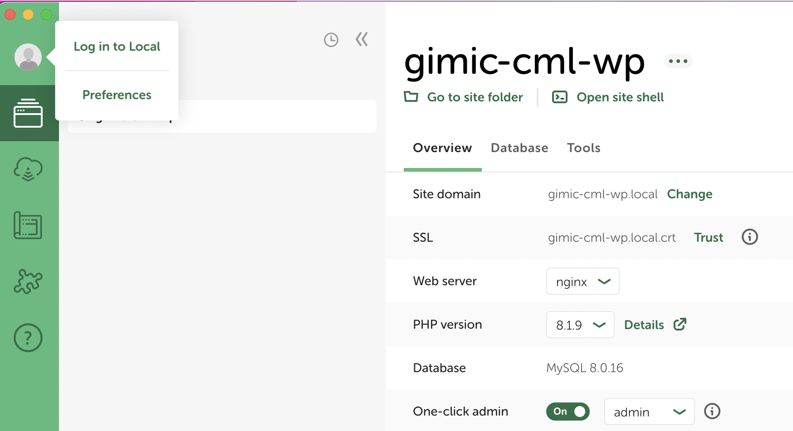
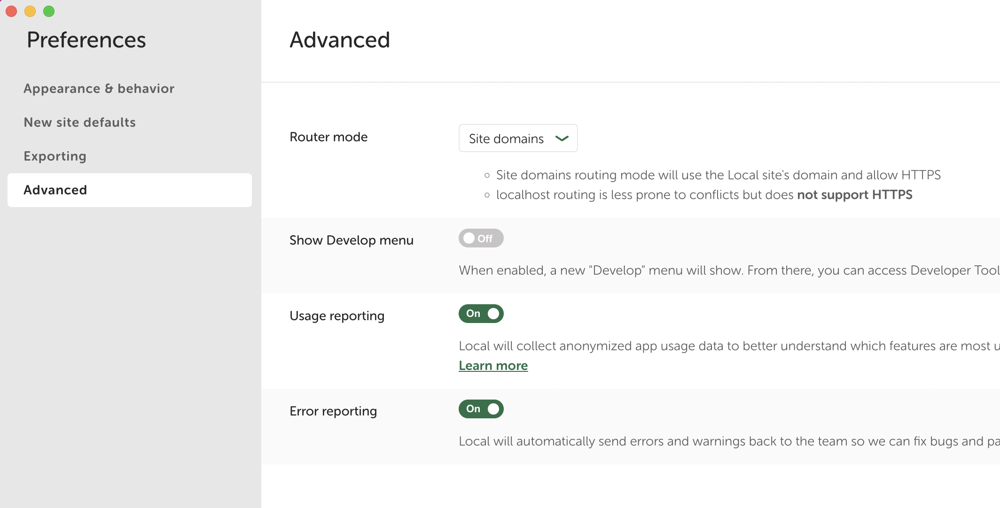
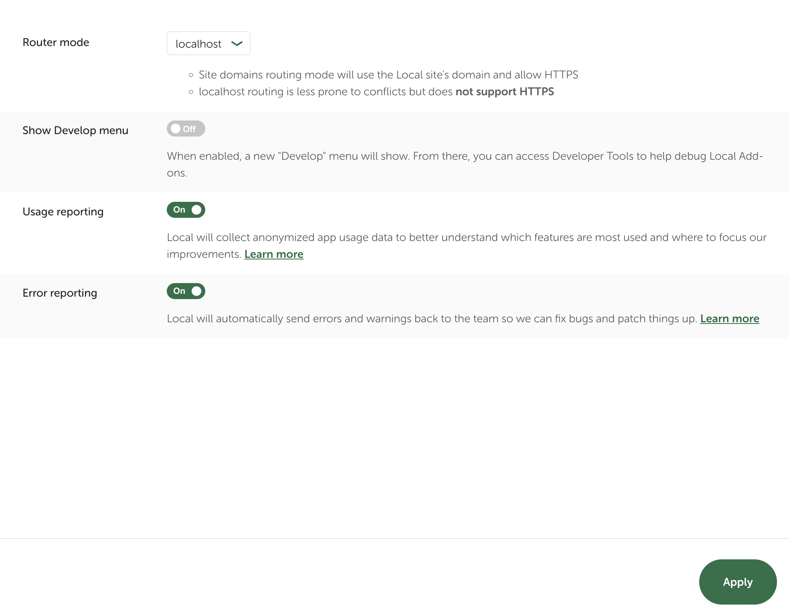
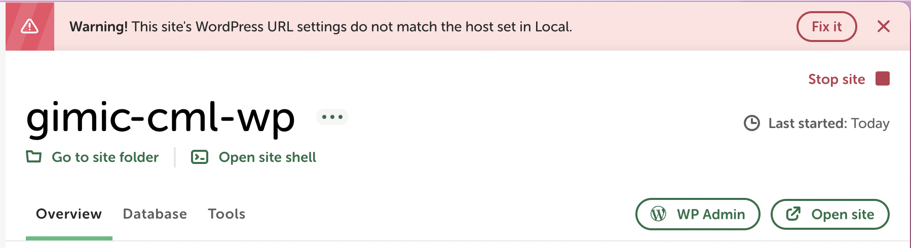
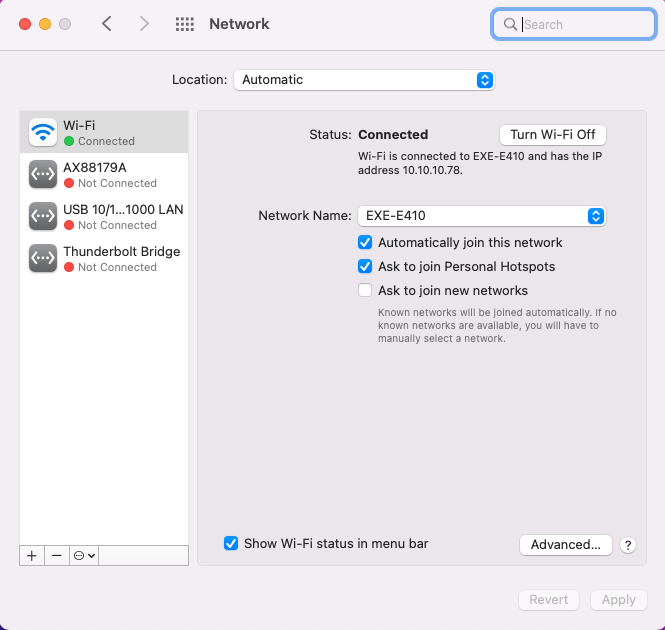
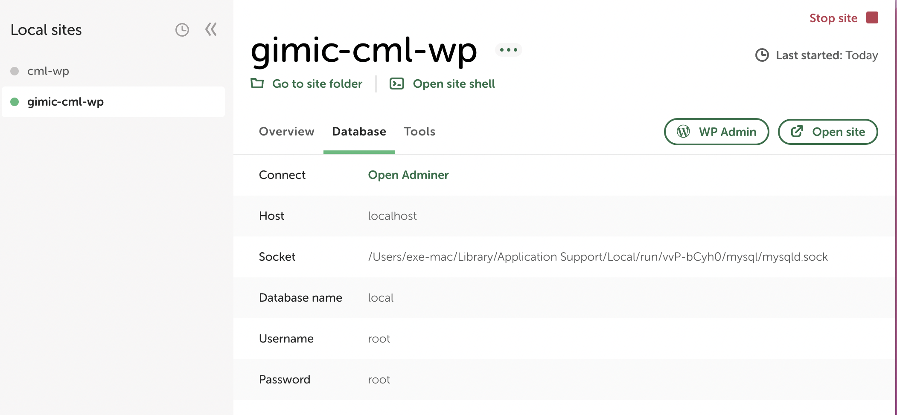
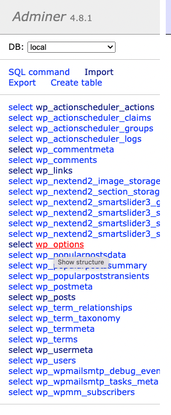
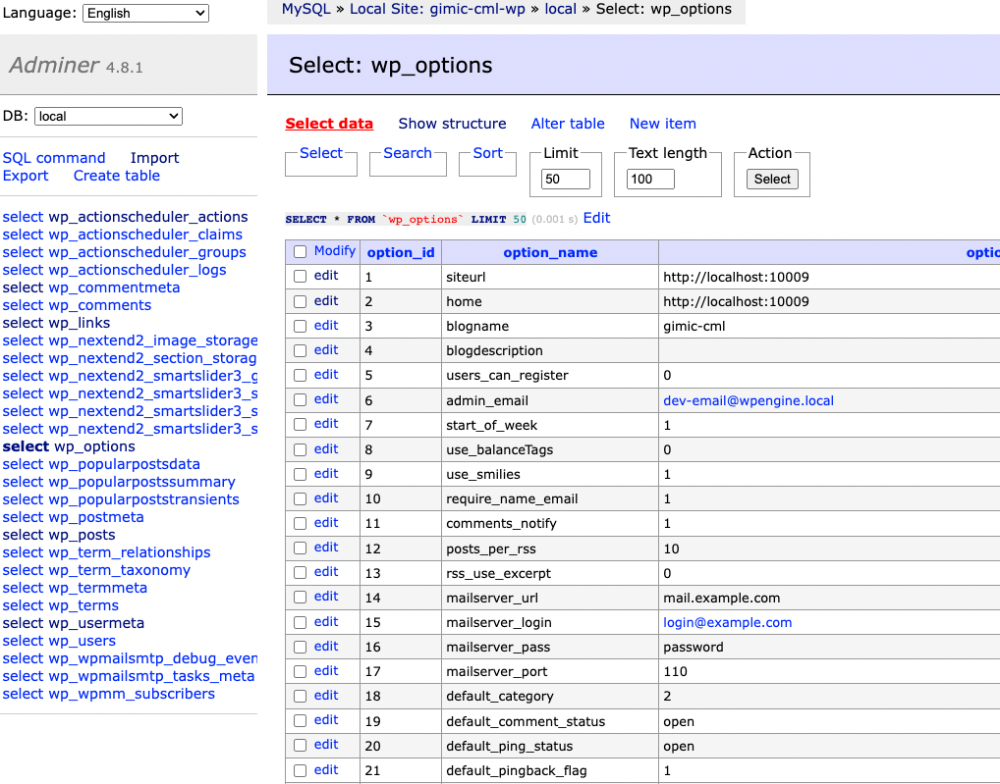
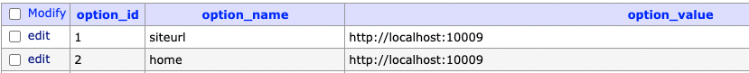
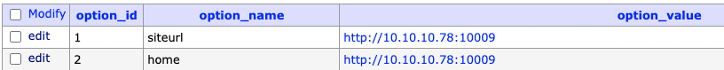

# HƯỚNG DẪN TRUY CẬP LOCAL WORDPRESS WEBSITE TRÊN ĐIỆN THOẠI BẰNG CÔNG CỤ LOCALWP

Chắc hẳn với vai trò là một frontend developer, đối với những project yêu cầu khả năng responsive - tính tương thích trên nhiều loại device khác nhau, trong giai đoạn development bạn sẽ không thể bỏ qua bước kiểm tra cả về UI và logic trên các thiết bị di động, đảm bảo các tính năng hoạt động đúng mong đợi như bản PC.
Thông thường, khi code React hay Next, muốn truy cập local trên mobile devices bạn chỉ cần join chung mạng, sử dụng địa chỉ ip của máy tính là có thể truy cập được. Tuy nhiên, đối với Wordpress, ở đây mình đề cập đến [Localwp](https://localwp.com/) - `local Wordpress development tool`, mặc định công cụ này sẽ sử dụng Router mode là `site domain`, tức là nó sẽ tạo ra một domain để có thể truy cập được trên chính máy tính của bạn ở local và dĩ nhiên bạn sẽ không thể truy cập domain này trên các device khác. 
Chính vì lý do trên, trong bài lesson này mình sẽ hướng dẫn bạn cấu hình Localwp để có thể truy cập được trên các thiết bị khác.

### 1. Cấu hình domain về localhost

- Mở `Local` Wp → chọn Project → click vào avatar → chọn `Preferences`

  

- Màn hình Preferences xuất hiện → chọn tab Advanced.
    

- Tại Router mode chọn `localhost` → click `Apply` 

    

- Click X để đóng lại popup setting, khi đó App Local sẽ warning như sau:
    

- Mạnh dạn click vào `Fix it` và đợi cho đến khi hoàn tất.
- Chú ý rằng địa chỉ hiện tại được show trên App là `localhost:10009`.

### 2. Xác định ipv4 và truy cập
- Bạn chỉ cần xác định được ipv4 là có thể truy cập được website thông qua địa chỉ ip.
- Với Windows, gõ `ipconfig` trên terminal.
- Với MacOS, bạn chỉ cần Click vào icon Apple → System Preferences → Network. IP Address sẽ hiện thị ở Tab Wifi.

    

- Mở browser trên điện thoại nhập đúng host và post theo format sau: `http://{ip}:{port}`
- Với ip hiện tại `10.10.10.78` và port `10009` ta truy cập URL như sau: `http://10.10.10.78:10009`
- Tuy nhiên, hiện tại resource ở device đang sai đường dẫn nên không load được assets (js, css, image). Chúng ta cần cấu hình trong database ở bước tiếp theo.

### 3. Thay đổi cấu hình trong database
- Vào LocalWp App → Chọn Tab `Database` → Click `Open Adminer`

    

- Ở panel bên trái chọn `wp_options` → Click vào `Select data`

    
    

- Dữ liệu hiện ra, chúng ta cần update lại value cho 2 fields sau thành: `http://{ip}:{port} (http://10.10.10.78:10009)`

**Before:**

**After:**

- Reload lại site trên device → work fine 😜

***
Hết