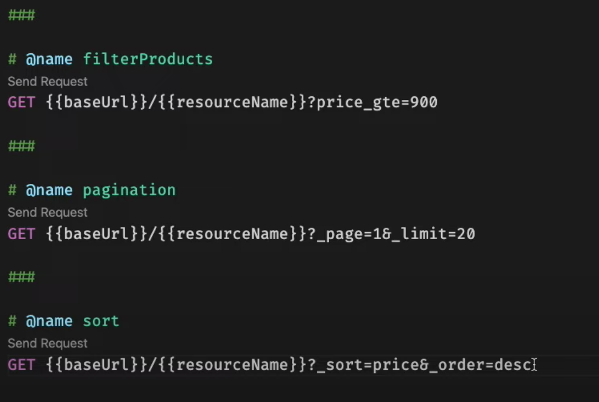

### 1. Setup Json-server

`npm i -g json-server`

- Create file `db.json`
- Trong đó chứa object có nhiều key, mỗi key tương ứng với 1 collection khác nhau.
  Example:
  ```json
  {
    "categories": [
      {
        "id": 1,
        "name": "SmartPhone"
      }
    ]
  }
  ```
- Run: `json-server --watch db.json`
- Test: `curl http://localhost:3000/categories`

### 2. Setup custom json-server

- `npm init -y`
- `npm install -g nodemon`
- Trong file package.json add 2 script:
  ```json
  'dev': 'nodemon index.js'
  'start': 'node index.js'
  ```
- Trong index.js:

```js
const jsonServer = require("json-server");
const server = jsonServer.create();
const router = jsonServer.router("db.json");
const middlewares = jsonServer.defaults();

// Set default middlewares (logger, static, cors and no-cache)
server.use(middlewares);

// Add custom routes before JSON Server router
server.get("/echo", (req, res) => {
  res.jsonp(req.query);
});

// To handle POST, PUT and PATCH you need to use a body-parser
// You can use the one used by JSON Server
server.use(jsonServer.bodyParser);
server.use((req, res, next) => {
  if (req.method === "POST") {
    req.body.createdAt = Date.now();
  }
  // Continue to JSON Server router
  next();
});

// Use default router
server.use(router);
server.listen(3000, () => {
  console.log("JSON Server is running");
});
```
Link: [Source github](https://github.com/typicode/json-server#simple-example)


### 3. Gọi API trực tiếp từ VSCode
- Install extension in VS `rest client`
- Create file \<nameFile>.http
- Example:
  ```css
  @baseUTL = http://localhost:3000/api

  # categories
  # @name getAllCategories
  GET {{baseURL/categories}}

  ###

  # @name addNewCategory
  POST {{baseURL/categories}}
  Content-Type: application/json
  /*Params */
  {
    name: 'Laptop'
  } 

  ```

### 4. Random dữ liệu với Faker.js
- `npm i --save-dev faker`


```js
const faker = require('faker')

//language
faker.locale = 'vi'

//random data
console.log(faker.commerce.department())
...

```

- Change script: 'start': 'npm run generate-data && node index.js'

### 5. Random dữ liệu cho danh mục sản phẩm
- Create an IFFE


```js
const randomCategoryList = (n) => {
  if (n <= 0) return [];
  const categoryList = []
  Array.from(new Array(n)).forEach(() => {
    const category = {
      id: faker.random.uuid,
      name: faker.commerce.department(),
      createdAt: Date.now(),
      updatedAt: Date.now()
    }
    categoryList.push(category)
  })
}
(() => {
  //random data
  const categoryList = randomCategoryList(4)

  //prepare db object
  const db  = {
    categories: categoryList
  }

  //write db object to db.json
  fs.writeFile('db.json', JSON.stringify(db), () => {
    console.log('generate data successfully!')
  })
})
```

### 6. Random dữ liệu cho sản phẩm
```js

const productList = []
for (const category of categoryList) {
  Array.from(new Array(numberOfProducts)).forEach(() => {
    const product = {
      categoryId : category.id,
      id: faker.random.uuid().
      name: faker.commerce.productName(),
      color: faker.commerce.color(),
      price: Number.parseFloat(faker.commerce.price()),
      description: faker.commerce.productDescription(),
      createdAt: Date.now(),
      updatedAt: Date.now(),
      thumbnailUrl: faker.image.imageUrl(400,400)
    }

    productList.push(product)
  })
}
```

### 7. Tìm kiếm, lọc và phân trang với Json-server


### 8. Tự động thêm createdAt, updatedAt
```js
server.use((req, res, next) => {
  if (req.method === "POST") {
    req.body.createdAt = Date.now();
    req.body.updatedAt = Date.now();
  } else 
  if (req.method === "PATCH) {
    req.body.updatedAt = Date.now();
  }
  // Continue to JSON Server router
  next();
});
```

### 9. Custom output cho endpoint listing
To modify responses, overwrite router.render method:

// In this example, returned resources will be wrapped in a body property
```js
router.render = (req, res) => {
  res.jsonp({
    body: res.locals.data
  })
}
```

Code example:
```js
const header = res.getHeaders()

const totalCountHeader = headers['x-total-count']

if (req.method === 'GET' && totalCountHeader) {
  const queryOarams = queryString.parse(req._parseUrl.query)

  const result = {
    data: res.locals.data,
    pagination: {
      _page: Number.parseInt(queryParams._page) || 1,
      _limit: Number.parseInt(queryParams._limit) || 10,
      _totalRows: Number.parseInt(totalCountHeader)
    }
  }

  return res.jsonp(result)
}
```

**? What is the different between `json` & `jsonp` ?**
- jsonp (Json With Padding)
- Basically, you're not allowed to request JSON data from another domain via AJAX due to same-origin policy. 
- We can abuse `jsonp` and use it to fetch data instead! 
- JSON is already valid JavaScript, but we can't just return JSON in our script file
- So what we do instead is tell the web service to call a function on our behalf when it's ready.

--> In sum, JSONP allows you to specify a callback function that is passed your JSON object. This allows you to bypass the same origin policy and load JSON `from an external server` into the JavaScript on your webpage.
```js
function func(json){
  alert(json.name);
}
var elm = document.createElement("script");
elm.setAttribute("type", "text/javascript");
elm.src = "http://example.com/jsonp";
document.body.appendChild(elm);
```
