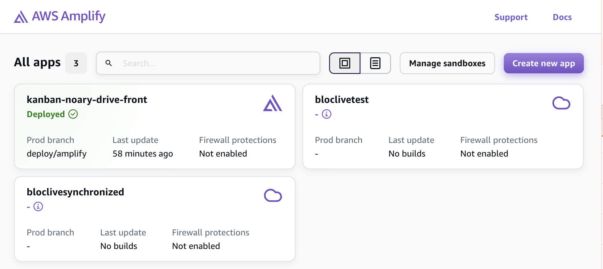
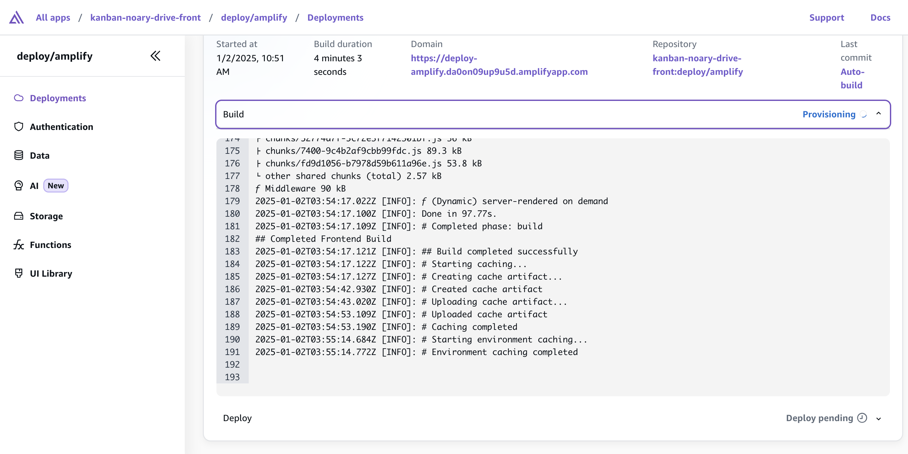

## 1.Introduction

- AWS Amplify is everything frontend developers need to develop and deploy cloud-powered fullstack applications without hassle. Easily connect your frontend to the cloud for data modeling, authentication, storage, serverless functions, SSR app deployment, and more.
- You can use AWS Amplify to build, connect, and host fullstack apps on AWS: React, Next.js, Angular,

## 2. Concepts

- Use a Typescript-based
- Code-first DX (developer experience) for defining Backend
- Offer: hosting, BE, UI-building, code-first approach
- Frontend Dev can deploy cloud infra by simply app data model, business logic, authen, author rules in TS
- Can use for end-to-end fullstack development

### Build fullstack apps with TS

- In Gen2, TS code with some conventions → strict type help prevent errors.

### Fast local development

- Provide sandbox env for each developer which are optimized for faster. (8X faster then Gen 1)
- Get an isolated cloud development environment → can test changes easily without disrupting each other’s environments

### Fullstack Git-based environments

- Environments which are map 1:1 to Git branches in your repo. → can be tested win env with PR previews.
- Compare with Gen1, it requires a lot of configurations in CLI or Console

### Unified management console

- All branches can be managed in the new Amplify console. It proves a single place for you to mange: build version, hosting settings, deployed resources, env vars, secrets.
- Provide sandbox env for each developer which are optimized for faster. (8X faster than Gen 1)
- Get an isolated cloud development environment → can test changes easily without disrupting each other’s environments

## 2. Deploy NextJS application throughout Github repository

Go to [AWS Amplify Console](https://ap-southeast-1.console.aws.amazon.com/amplify/apps) click button `Create new app` to create new amplify application.


### 2.1 Choose source code provider


Choose `GitHub` and click `Next`. A popup will appear, requiring you to grant Amplify access to the repository you want to deploy.

### 2.2 Add repository and branch

Select a `repository` and a `branch` you want to deploy, then click `Next`.


### 2.3 App settings

Review the App name and Build settings, and modify them if needed:

- **App name**: Default value is derived from the GitHub repository.
- **Frontend build command**: For example, yarn run build.
- **Build output directory**: For example, .next, .out, .build, etc.


**Service role**: Amplify requires permissions to publish Server-Side Rendering (SSR) logs to your CloudWatch account. Please create a new service role or use an existing one.


**Advanced settings:**

If your project uses environment variables:

- Add all variables in the `Environment variables` section.


- Back to `Build settings` and update the `Build commands` configuration by clicking the Edit YML File button. Example:

```yml
version: 1
frontend:
    phases:
        preBuild:
            commands:
                - 'yarn install --frozen-lockfile'
        build:
            commands:
                - 'env | grep -e DOMAIN -e FIREBASE_ADMIN_CLIENT_EMAIL -e FIREBASE_ADMIN_PRIVATE_KEY -e AUTH_COOKIE_NAME -e AUTH_COOKIE_SIGNATURE_KEY_CURRENT -e AUTH_COOKIE_SIGNATURE_KEY_PREVIOUS -e USE_SECURE_COOKIES >> .env.production'
                - 'env | grep -e NEXT_PUBLIC_ >> .env.production'
                - 'yarn build'
    artifacts:
        baseDirectory: .next
        files:
            - '**/*'
    cache:
        paths:
            - '.next/cache/**/*'
            - 'node_modules/**/*'
```

 The build commands section writes environment variables to the `.env.production` file before building the application.

### 2.4 Review


Review all information:

- Repository details
- App settings
- Advanced settings

=> Once everything is confirmed, click `Save and deploy`.

### 2.5 Management

- **Manage application overview**: View and manage hosting and app settings.

- **Deployment versions**: View all deployment versions for a specific branch by selecting it on the overview screen.

- **Deployment logs**: Access detailed deployment logs for debugging and monitoring.

