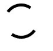
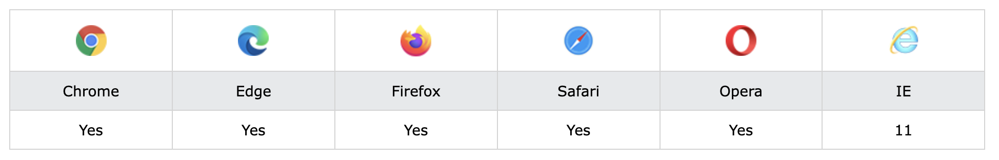
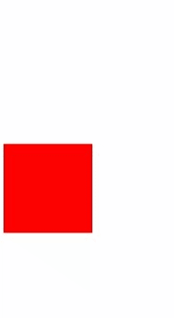

## Overview

### Opening

Opening by the following example:

**Spinner loading**

```html
<div class="ring"></div>
```

```css
.ring {
	width: 50px;
	height: 50px;
	border-radius: 100rem;
	border: 5px solid black;
	border-right: 5px solid transparent;
	border-left: 5px solid transparent;
	animation: spinner 1s infinite linear;
}

@keyframes spinner {
	to {
		transform: rotate(360deg);
	}
}
```

The result is:


### Concepts

*What is the animation css property?*
- The animation shorthand CSS property **applies an animation between styles**. It is a shorthand for:
  - animation-name
  - animation-duration
  - animation-timing-function
  - animation-delay
  - animation-iteration-count
  - animation-direction
  - animation-fill-mode
  - animation-play-state


**Summary animation css properties:**
| **#** | **name**                  | **description**                                            | **default value** |
| ----- | ------------------------- | ---------------------------------------------------------- | ----------------- |
| 1     | animation-name            | Name of the keyframe                                       | none              |
| 2     | animation-duration        | Seconds or milliseconds an animation takes to complete     | 0                 |
| 3     | animation-timing-function | The speed curve of the animation                           | ease              |
| 4     | animation-delay           | A delay before the animation will start                    | 0                 |
| 5     | animation-iteration-count | Number of times an animation should be played              | 1                 |
| 6     | animation-direction       | Should the animation play in reverse on alternate cycles   | normal            |
| 7     | animation-fill-mode       | Values are applied outside the time animation is executing | none              |
| 8     | animation-play-state      | Specifies whether the animation is running or paused       | running           |


### Syntax

```js
animation = "name duration timingFunction delay iterationCount direction fillMode playState"
```

### Browser Support
`animation` is a CSS3 (1999) feature.
It is fully supported in all browsers:


## Properties detail

### 1. animation-name
- Sets or returns a name for the @keyframes animation
```js
animation-name = "none|keyframename|initial|inherit"
```

### 2. animation-duration
- Defines how many seconds or milliseconds an animation takes to complete one cycle.
```js
animation-duration: "time|initial|inherit"
```

### 3. animation-timing-function
- Specifies the speed curve of the animation.
- The speed curve defines the TIME an animation uses to change from one set of CSS styles to another.
- The speed curve is used to make the changes smoothly.
  
```js
animation-timing-function: "linear|ease|ease-in|ease-out|cubic-bezier(n, n, n, n)|initial|inherit"
```

| **Value**                    | **Description**                                                                                                                                                                                                                                                                                                                |
| ---------------------------- | ------------------------------------------------------------------------------------------------------------------------------------------------------------------------------------------------------------------------------------------------------------------------------------------------------------------------------ |
| linear                       | Equal to `cubic-bezier(0.0, 0.0, 1.0, 1.0)`. The animation has the same speed from start to end.                                                                                                                                                                                                                            |
| ease                         | Default value. Equal to `cubic-bezier(0.25, 0.1, 0.25, 1.0)`. The animation has a slow start, then fast, before it ends slowly.                                                                                                                                                                                             |
| ease-in                      | Equal to `cubic-bezier(0.42, 0, 1.0, 1.0)`. Starts off slowly with the speed of the transition of the animating property increasing until complete.                                                                                                                                                                         |
| ease-out                     | Equal to `cubic-bezier(0, 0, 0.58, 1.0)`. Starts quickly, slowing down the animation continues                                                                                                                                                                                                                              |
| ease-in-out                  | Equal to `cubic-bezier(0.42, 0, 0.58, 1.0)`. With the animating properties slowly transitioning, speeding up, and then slowing down again.                                                                                                                                                                                  |
| cubic-bezier(p1, p2, p3, p4) | With the animating properties slowly transitioning, speeding up, and then slowing down again.                                                                                                                                                                                                                                  |
| steps(n, `<jumpterm>`)         | Displays an animation iteration along n stops along the transition. Displaying each stop for equal lengths of time.\nN stops including the 0% and 100% marks depends on which of the following jump terms is used:\n- `jump-start` (same with `start`)\n- `jump-end` (same with `end`)\n- `jump-none`\n- `jump-both` |

### 4. animation-delay
- Defines when the animation will start.
- The animation-delay value is defined in seconds (s) or milliseconds (ms).
- Negative values are also allowed. If using negative values, the animation will start as if it had already been playing for N seconds.

```js
animation-delay: "time|initial|inherit"
```

### 5. animation-iteration-count
- Sets or returns how many times an animation should be played.
 
```js
animation-iteration-count: "time|initial|inherit"
```

### 6. animation-direction
- Sets or returns whether or not the animation should play in reverse on alternate cycles.
- If the animation is set to play only once, this property will have no effect.
  
```js
animation-direction: "normal|reverse|alternate|alternate-reverse|initial|inherit"
```

| **Value**         | **Description**                                                                                                                         |
| ----------------- | --------------------------------------------------------------------------------------------------------------------------------------- |
| normal            | Default value. The animation should be played as normal                                                                                 |
| reverse           | The animation should play in reverse direction                                                                                          |
| alternate         | The animation will be played as normal every odd time (1,3,5,etc..) and in reverse direction every even time (2,4,6,etc...)             |
| alternate-reverse | The animation will be played in reverse direction every odd time (1,3,5,etc..) and in a normal direction every even time (2,4,6,etc...) |

### 7. animation-fill-mode
- Specifies what styles will apply for the element when the animation is not playing (when it is finished, or when it has a "delay"). 
- CSS animations will not affect the animating element until the first keyframe is "played" and stops affecting it once the last keyframe has completed. The **animationFillMode** property can **override** this behavior.
  
```js
animation-fill-mode: "none|forwards|backwards|both|initial|inherit"
```

**Properties value description:**

| **Value** | **Description**                                                                                                                                                                                                                                                                                                                   |
| --------- | --------------------------------------------------------------------------------------------------------------------------------------------------------------------------------------------------------------------------------------------------------------------------------------------------------------------------------- |
| none      | Default value. The animation will not apply any styles to the target before or after it is executing.                                                                                                                                                                                                                             |
| forwards  | After the animation ends (determined by animation-iteration-count).\nThe animation will apply the property values for the time the animation ended.                                                                                                                                                                            |
| backwards | Apply the property values defined in the keyframe that will start the first iteration of the animation.\n(during the period defined by animation-delay).\nThese are either the values of:\n- from: when animation-direction is "normal" or "alternate"\n- to: when animation-direction is "reverse" or "alternate-reverse" |
| both      | The animation will follow the rules for both forwards and backwards. \nThat is, it will extend the animation properties in both directions                                                                                                                                                                                      |

### 8. animation-play-state 
- Specifies whether the animation is running or paused.

```js
animation-play-state : "running|paused|initial|inherit"
```

## CSS Keyframe rule

**Example:** Make an element move gradually 200px down:

```css
@keyframes mymove {
  from {top: 0px;}
  to {top: 200px;}
}
```

- The @keyframes rule specifies the animation code.
- During the animation, you can change the set of CSS styles many times.
- Specify when the style change will happen in percent, or with the keywords "from" (0%) and "to" (100%).
- For best browser support, you should always define both the 0% and the 100% selectors.
- The !important rule is ignored in a keyframe.


**Example:** Add many keyframe selectors in one animation
```html
<div></div>
```

```css
div {
  width: 100px;
  height: 100px;
  background: red;
  position: relative;
  animation: mymove 5s infinite;
}

@keyframes mymove {
  0%   {top: 0px;}
  25%  {top: 200px;}
  75%  {top: 50px}
  100% {top: 100px;}
}
```
The result is:


