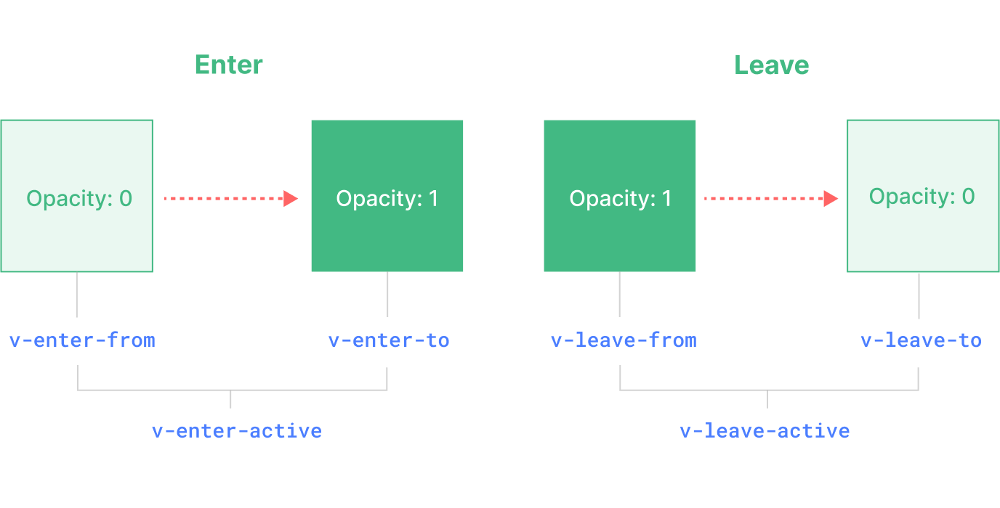

# VUE 3 - BUILD IN COMPONENTS

## Transition
- Vue offers two built-in components that can help work with transitions and animations:
  - `<Transition>`
  - `<TransitionGroup>`

#### The `<Transition>` Component:
- `<Transition>` is a built-in component that we can use without having to register it.
- The enter or leave animations on elements can be triggered by one of the following:
  - Conditional rendering via `v-if`
  - Conditional display via `v-show`
  - Dynamic components toggling via the `<component>` special element
  - Changing the special key attribute

**Example:**
```html
<button @click="show = !show">Toggle</button>
<Transition>
  <p v-if="show">hello</p>
</Transition>
```

```css
/* we will explain what these classes do next! */
.v-enter-active,
.v-leave-active {
  transition: opacity 0.5s ease;
}

.v-enter-from,
.v-leave-to {
  opacity: 0;
}
```

> `<Transition>` only supports a single element or component as its slot content.

When an element in a `<Transition> `component is inserted or removed, this is what happens:
-  If the target element has CSS transitions or animations applied, a number of CSS transition classes will be added / removed at appropriate timings.
-  If there are listeners for JavaScript hooks, these hooks will be called at appropriate timings.
- If no CSS transitions / animations, JavaScript hooks, the DOM operations for insertion and/or removal will be executed on the browser's next animation frame.

#### CSS-Based Transitions
**Transition Classes**
There are six classes applied for enter / leave transitions.

1. `v-enter-from`: Starting state for enter
2. `v-enter-active`: Active state for enter
3. `v-enter-to`: Ending state for enter
4. `v-leave-from`: Starting state for leave
5. `v-leave-active`: Active state for leave
6. `v-leave-to`: Ending state for leave

**Named Transitions**
A transition can be named via the `name` prop:
```html
<Transition name="fade">
  ...
</Transition>
```

Transition classes will be prefixed with its name instead of `v`.
The CSS for the fade transition should look like this:
```css
.fade-enter-active,
.fade-leave-active {
  transition: opacity 0.5s ease;
}

.fade-enter-from,
.fade-leave-to {
  opacity: 0;
}
```

**CSS Transitions**
Her is a example that transitions multiple properties, with different durations and easing curves for enter and leave:
```html
<Transition name="slide-fade">
  <p v-if="show">hello</p>
</Transition>
```

```css
/*
  Enter and leave animations can use different
  durations and timing functions.
*/
.slide-fade-enter-active {
  transition: all 0.3s ease-out;
}

.slide-fade-leave-active {
  transition: all 0.8s cubic-bezier(1, 0.5, 0.8, 1);
}

.slide-fade-enter-from,
.slide-fade-leave-to {
  transform: translateX(20px);
  opacity: 0;
}
```

**CSS Animations**
- The difference being that *-enter-from is not removed immediately after the element is inserted, but on an animationend event.
- We can simply declare them under the *-enter-active and *-leave-active classes. Here's an example:
```html
<Transition name="bounce">
  <p v-if="show" style="text-align: center;">
    Hello here is some bouncy text!
  </p>
</Transition>
```
```css
.bounce-enter-active {
  animation: bounce-in 0.5s;
}
.bounce-leave-active {
  animation: bounce-in 0.5s reverse;
}
@keyframes bounce-in {
  0% {
    transform: scale(0);
  }
  50% {
    transform: scale(1.25);
  }
  100% {
    transform: scale(1);
  }
}
```

**Custom Transition Classes**
This is especially useful when you want to combine Vue's transition system with an existing CSS animation library, such as `Animate.css`:
```html
<!-- assuming Animate.css is included on the page -->
<Transition
  name="custom-classes"
  enter-active-class="animate__animated animate__tada"
  leave-active-class="animate__animated animate__bounceOutRight"
>
  <p v-if="show">hello</p>
</Transition>
```
**Using Transitions and Animations Together**
- In some cases you may want to have both on the same element, you will have to explicitly declare the type you want Vue to care about by passing the type prop, with a value of either `animation` or `transition`:
```html
<Transition type="animation">...</Transition>
```

**Nested Transitions and Explicit Transition Durations**
We can transition nested elements using nested CSS selectors:
```html
<Transition name="nested">
  <div v-if="show" class="outer">
    <div class="inner">
      Hello
    </div>
  </div>
</Transition>
```

```css
/* rules that target nested elements */
.nested-enter-active .inner,
.nested-leave-active .inner {
  transition: all 0.3s ease-in-out;
}

.nested-enter-from .inner,
.nested-leave-to .inner {
  transform: translateX(30px);
  opacity: 0;
}

/* ... other necessary CSS omitted */
```
If necessary, you can also specify separate values for enter and leave durations using an object:
```html
<Transition :duration="{ enter: 500, leave: 800 }">...</Transition>
```

**Performance Considerations**
-  Property `transform` and `opacity` are efficient to animate because:
   -  They do not affect the document layout during the animation.
   -  Most modern browsers can leverage GPU hardware acceleration when animating `transform`.

- we should use properties like `height`, `margin` with caution because they are much more expensive to animate.


#### JavaScript Hooks
You can hook into the transition process with JavaScript by listening to events on the `<Transition>` component:

```html
<Transition
  @before-enter="onBeforeEnter"
  @enter="onEnter"
  @after-enter="onAfterEnter"
  @enter-cancelled="onEnterCancelled"
  @before-leave="onBeforeLeave"
  @leave="onLeave"
  @after-leave="onAfterLeave"
  @leave-cancelled="onLeaveCancelled"
>
  <!-- ... -->
</Transition>
```
- When using JavaScript-only transitions, it is usually a good idea to add the `:css="false"` prop. → skip auto CSS transition detection,  prevents CSS rules from accidentally interfering with the transition.
- With `:css="false"`, we are also fully responsible for controlling when the transition ends. 
- The `done` callbacks are required for the `@enter` and `@leave` hooks. Otherwise, the hooks will be called synchronously and the transition will finish immediately.


**Reusable Transitions**
To create a reusable transition, we can create a component that wraps the `<Transition>` component and passes down the slot content:
```html
<!-- MyTransition.vue -->
<script>
// JavaScript hooks logic...
</script>

<template>
  <!-- wrap the built-in Transition component -->
  <Transition
    name="my-transition"
    @enter="onEnter"
    @leave="onLeave">
    <slot></slot> <!-- pass down slot content -->
  </Transition>
</template>

<style>
/*
  Necessary CSS...
  Note: avoid using <style scoped> here since it
  does not apply to slot content.
*/
</style>
```


