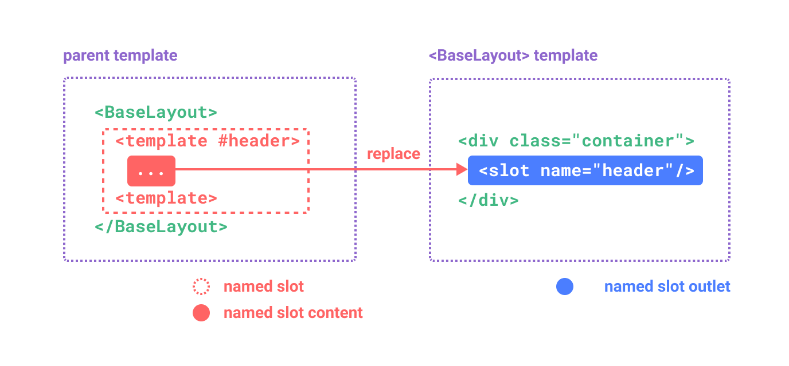
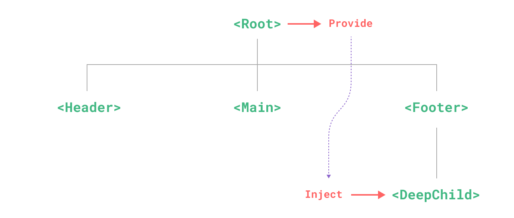

# VUE 3 - COMPONENTS IN DEPTH

## Component Registration
- There are two ways to register components: global and local.
#### Global Registration
- using the `app.component()` method:
```ts
import { createApp } from 'vue'

const app = createApp({})

app.component(
  // the registered name
  'MyComponent',
  // the implementation
  {
    /* ... */
  }
)
```
If using SFCs, you will be registering the imported `.vue` files:
```ts
import MyComponent from './App.vue'

app.component('MyComponent', MyComponent)
```
The app.component() method can be chained:
```ts
app
  .component('ComponentA', ComponentA)
  .component('ComponentB', ComponentB)
  .component('ComponentC', ComponentC)
```

#### Local Registration
- Makes the dependency relationship more explicit, and is more tree-shaking friendly.
- When using SFC with `<script setup>`, imported components can be locally used without registration.
```ts
<script setup>
import ComponentA from './ComponentA.vue'
</script>

<template>
  <ComponentA />
</template>
```
- Locally registered components are not also available in descendant components.

#### Component Name Casing
- using PascalCase names when registering components:
  - PascalCase names are valid JavaScript identifiers
  - `<PascalCase />` makes it more obvious that this is a Vue component

## Props
### Props Declaration
In SFCs using `<script setup>`, props can be declared using the `defineProps()` macro:
```ts
<script setup>
const props = defineProps(['foo'])

console.log(props.foo)
</script>
```

In addition to declaring props using an array of strings, we can also use the object syntax:
```js
// in <script setup>
defineProps({
  title: String,
  likes: Number
})
```
If you are using TypeScript with `<script setup>`
```js
<script setup lang="ts">
defineProps<{
  title?: string
  likes?: number
}>()
</script>
```

### Prop Passing Details
#### Prop Name Casing
```ts
defineProps({
  greetingMessage: String
})
```
```html
<span>{{ greetingMessage }}</span>
```
- You can use `camelCase` when passing props to a child component. However, the convention is using kebab-case in all cases to align with HTML attributes:
```html
<MyComponent greeting-message="hello" />
```

#### Static vs. Dynamic Props
you've seen props passed as static values
```html
<BlogPost title="My journey with Vue" />
```
You've also seen props assigned dynamically with v-bind or its : shortcut, such as in:
```html
 <!-- Dynamically assign the value of a variable -->
<BlogPost :title="post.title" />

<!-- Dynamically assign the value of a complex expression -->
<BlogPost :title="post.title + ' by ' + post.author.name" />
```

#### Passing Different Value Types
```jsx
// Number
<BlogPost :likes="42" />
<BlogPost :likes="post.likes" />

// Boolean 
<BlogPost is-published />
<BlogPost :is-published="false" />
<BlogPost :is-published="post.isPublished" />

// Array
<BlogPost :comment-ids="[234, 266, 273]" />
<BlogPost :comment-ids="post.commentIds" />

// Object
<BlogPost
  :author="{
    name: 'Veronica',
    company: 'Veridian Dynamics'
  }"
 />
<BlogPost :author="post.author" />

const post = {
  id: 1,
  title: 'My Journey with Vue'
}

<BlogPost v-bind="post" />
```
### One-Way Data Flow
- All props form a **one-way-down** binding between the child property and the parent one.
- Every time the parent component is updated, all props in the child component will be refreshed with the latest value.
- Prevents child components from accidentally mutating the parent's state.
```ts
const props = defineProps(['foo'])

// ❌ warning, props are readonly!
props.foo = 'bar'
```

- The prop is used to pass in an initial value.
- The prop is passed in as a raw value that needs to be transformed.
### Prop Validation
- To specify prop validations, you can provide an object with validation requirements to the defineProps() macro:
```js
defineProps({
  // Basic type check
  //  (`null` and `undefined` values will allow any type)
  propA: Number,
  // Multiple possible types
  propB: [String, Number],
  // Required string
  propC: {
    type: String,
    required: true
  },
  // Number with a default value
  propD: {
    type: Number,
    default: 100
  },
  // Object with a default value
  propE: {
    type: Object,
    // Object or array defaults must be returned from
    // a factory function. The function receives the raw
    // props received by the component as the argument.
    default(rawProps) {
      return { message: 'hello' }
    }
  },
  // Custom validator function
  propF: {
    validator(value) {
      // The value must match one of these strings
      return ['success', 'warning', 'danger'].includes(value)
    }
  },
  // Function with a default value
  propG: {
    type: Function,
    // Unlike object or array default, this is not a factory 
    // function - this is a function to serve as a default value
    default() {
      return 'Default function'
    }
  }
})
```
- When prop validation fails, Vue will produce a console warning (if using the development build).
- An absent optional prop will have `undefined` value (except Boolean).
- `type` can be: `String`, `Number`, `Boolean`, `Array`, `Object`, `Date`, `Function`, `Symbol`.
- In addition, type can also be a custom class or constructor function and the assertion.
### Boolean Casting
- Given a `<MyComponent>` with the following declaration:
```js
defineProps({
  disabled: Boolean
})
```
The component can be used like this:
```html
<!-- equivalent of passing :disabled="true" -->
<MyComponent disabled />

<!-- equivalent of passing :disabled="false" -->
<MyComponent />
```
When a prop is declared to allow multiple types ([Boolean, Number]), the casting rules for Boolean will apply.

## Component Events
- Child component:
```html
<!-- MyComponent -->
<button @click="$emit('someEvent')">click me</button>
```
- The parent can then listen to it using v-on.
- The `.once` modifier is also supported.
```html
<!-- Recommend use kebab-cased -->
<MyComponent @some-event="callback" />
<MyComponent @some-event.once="callback" />
```
- We can pass extra arguments to `$emit`:
- All extra arguments passed to `$emit()` after the event name will be forwarded to the listener, with `$emit('foo', 1, 2, 3)` the listener function will receive **three** arguments.

```html
<button @click="$emit('increaseBy', 1)">
  Increase by 1
</button>
```
```html
<MyButton @increase-by="(n) => count += n" />
```
- The event handler is a method.
```html
<MyButton @increase-by="increaseCount" />
```
```js
function increaseCount(n) {
  count.value += n
}
```

#### Declaring Emitted Events
- using the `defineEmits()` macro, must be placed directly within `<script setup>`:
```ts
<script setup>
const emit = defineEmits(['inFocus', 'submit'])

function buttonClick() {
  emit('submit')
}
</script>
```
If you are using TypeScript with `<script setup>`
```html
<script setup lang="ts">
const emit = defineEmits<{
  (e: 'change', id: number): void
  (e: 'update', value: string): void
}>()
</script>
```

- It is recommended to define all emitted events in order to better document how a component should work.

#### Events Validation
- An emitted event can be validated if it is defined with the object syntax instead of the array syntax.
```ts
<script setup>
const emit = defineEmits({
  // No validation
  click: null,

  // Validate submit event
  submit: ({ email, password }) => {
    if (email && password) {
      return true
    } else {
      console.warn('Invalid submit event payload!')
      return false
    }
  }
})

function submitForm(email, password) {
  emit('submit', { email, password })
}
</script>
```

## Component v-model
`v-model` can be used on a component to implement a **two-way** binding.
When used on a component, `v-model` instead expands to this:
```html
<CustomInput
  :modelValue="searchText"
  @update:modelValue="newValue => searchText = newValue"
/>
```
Here's that in action:
```html
<!-- CustomInput.vue -->
<script setup>
defineProps(['modelValue'])
defineEmits(['update:modelValue'])
</script>

<template>
  <input
    :value="modelValue"
    @input="$emit('update:modelValue', $event.target.value)"
  />
</template>
```
Now v-model should work perfectly with this component:

```html
<CustomInput v-model="searchText" />
```

#### `v-model` arguments
By default, `v-model` uses `modalValue` as the props and `update:modelValue` as the event.
We can modify these names:
```html
<MyComponent v-model:title="bookTitle" />
```
→ expect a `title` prop and emit an `update:title` event.
```html
<!-- MyComponent.vue -->
<script setup>
defineProps(['title'])
defineEmits(['update:title'])
</script>

<template>
  <input
    type="text"
    :value="title"
    @input="$emit('update:title', $event.target.value)"
  />
</template>
```

#### Multiple v-model bindings
- Each` v-model` will sync to a different prop, without the need for extra options in the component:
```html
<UserName
  v-model:first-name="first"
  v-model:last-name="last"
/>
```
```html
<script setup>
defineProps({
  firstName: String,
  lastName: String
})

defineEmits(['update:firstName', 'update:lastName'])
</script>

<template>
  <input
    type="text"
    :value="firstName"
    @input="$emit('update:firstName', $event.target.value)"
  />
  <input
    type="text"
    :value="lastName"
    @input="$emit('update:lastName', $event.target.value)"
  />
</template>
```

#### Handling v-model modifiers
- `v-model` has built-in modifiers: .trim, .number and .lazy

- We want to create a custom modifier, `capitalize`, using like this:
```html
<MyComponent v-model.capitalize="myText" />
```
- Modifiers added to a component v-model will be provided to the component via the `modelModifiers` prop:
```html
<script setup>
const props = defineProps({
  modelValue: String,
  modelModifiers: { default: () => ({}) }
})

const emit = defineEmits(['update:modelValue'])

function emitValue(e) {
  let value = e.target.value
  if (props.modelModifiers.capitalize) {
    value = value.charAt(0).toUpperCase() + value.slice(1)
  }
  emit('update:modelValue', value)
}
</script>

<template>
  <input type="text" :value="modelValue" @input="emitValue" />
</template>
```

- In case both argument and modifiers → arg + "modifiers", example:
```html
<MyComponent v-model:title.capitalize="myText">
```
```js
const props = defineProps(['title', 'titleModifiers'])
defineEmits(['update:title'])

console.log(props.titleModifiers) // { capitalize: true }
```

## Fallthrough Attributes
#### Attribute Inheritance
A parent using this component with:
```html
<MyButton class="large" />
```
The final rendered DOM would be:
```html
<button class="large">click me</button>
```
→ `class` is treated as a fallthrough attribute and automatically added to `<MyButton>`'s root element.

**`class` and `style` Merging**:
- The child component's root element already has existing `class` or `style` attributes → merged with the class and style values inherited from the parent.

**`v-on` Listener Inheritance**:
- Same rule applies to `v-on` event listeners.
- Example, `click` event will be added to the root element of `button`. When the native `<button` is clicked, it will trigger the `onClick` method of the parent component.

**Nested Component Inheritance**:
- Example, `<MyButton/>` render `<BaseButton/>` as its root → the fallthrough attributes received by `<MyButton/>` will be automatically forwarded to `<BaseButton/>`.
#### Disabling Attribute Inheritance
- You can set `inheritAttrs: false` in the component's options.
- When using `setup`, you will need to declare this option using a separate `<script` block.
```html
<script>
// use normal <script> to declare options
export default {
  inheritAttrs: false
}
</script>

<script setup>
// ...setup logic
</script>
```
- These fallthrough attributes can be accessed directly in template expressions as `$attrs` (includes all attributes that are not declared by the component's `props` or `emits` options)
- If we want all fallthrough attributes to be applied to the inner `<button>`, not the outer `<div>`, we set `inheritAttrs: false` and use `v-bind="$attrs"`
```html
<div class="btn-wrapper">
  <button class="btn" v-bind="$attrs">click me</button>
</div>
```

#### Attribute Inheritance on Multiple Root Nodes​
- Components with multiple root nodes, if `$attrs` are not bound explicitly, a runtime warning will be issued.
```html
<header>...</header>
<main v-bind="$attrs">...</main>
<footer>...</footer>
```
#### Accessing Fallthrough Attributes in JavaScript
- You can access a component's fallthrough attributes in `<script setup>` using the `useAttrs()` API:
```html
<script setup>
import { useAttrs } from 'vue'

const attrs = useAttrs()
</script>
```
- The `attrs` always reflects the latest fallthrough attributes, it isn't reactive (for performance reasons).

## Slots
#### Slot Content and Outlet
For example, we may have a `<FancyButton> `component that supports usage like this:
```html
<!-- parent component -->
<FancyButton>
  Click me! <!-- slot content -->
</FancyButton>
```
The template of `<FancyButton>`:
```html
<!-- child component -->
<button class="fancy-btn">
  <slot></slot> <!-- slot outlet -->
</button>
```
The `<slot>` element is a **slot outlet** that indicates where the parent-provided slot content should be rendered.

And the final rendered DOM:
```html
<button class="fancy-btn">Click me!</button>
```
Slot content is not just limited to text. It can be any valid template content.

#### Render Scope
- Slot content has access to the data scope of the parent component because it is defined in the parent.
- Cannot access to the child component's data.
#### Fallback Content
- Fallback content will be rendered only when no content is provided.
- Example: we might want the text "Submit" to be rendered when the parent didn't provide any slot element:
```html
<button type="submit">
  <slot>
    Submit <!-- fallback content -->
  </slot>
</button>
```
#### Named Slots
```html
<div class="container">
  <header>
    <!-- We want header content here -->
  </header>
  <main>
    <!-- We want main content here -->
  </main>
  <footer>
    <!-- We want footer content here -->
  </footer>
</div>
```
- For these cases, the `<slot>` element has `name` attribute:
```html
<div class="container">
  <header>
    <slot name="header"></slot>
  </header>
  <main>
    <slot></slot>
  </main>
  <footer>
    <slot name="footer"></slot>
  </footer>
</div>
```
- A `<slot>` outlet without name implicitly has the name `"default"`.
- In a parent component using `<BaseLayout>`, we need to use a `<template>` element with the `v-slot` directive, and then pass the name of the slot as an argument to `v-slot `.
```html
<BaseLayout>
  <template v-slot:header>
    <!-- content for the header slot -->
  </template>
</BaseLayout>
```
`<template v-slot:header>` can be shortened to just `<template #header>`.

```html
<BaseLayout>
  <template #header>
    <h1>Here might be a page title</h1>
  </template>

  <template #default>
    <p>A paragraph for the main content.</p>
    <p>And another one.</p>
  </template>

  <template #footer>
    <p>Here's some contact info</p>
  </template>
</BaseLayout>
```
- **Note:** all top-level `non-<template>` nodes are implicitly treated as content for the default slot.
#### Dynamic Slot Names
```html
<base-layout>
  <template v-slot:[dynamicSlotName]>
    ...
  </template>

  <!-- with shorthand -->
  <template #[dynamicSlotName]>
    ...
  </template>
</base-layout>
```
#### Scoped Slots
- We can pass attributes to a slot outlet just like passing props to a component:
```html
<!-- <MyComponent> template -->
<div>
  <slot :text="greetingMessage" :count="1"></slot>
</div>
```
- Then, we can access data from child scope from parent component:
```html
<MyComponent v-slot="slotProps">
  {{ slotProps.text }} {{ slotProps.count }}
</MyComponent>

<!-- we can use destructuring in v-slot -->
<MyComponent v-slot="{ text, count }">
  {{ text }} {{ count }}
</MyComponent>
```


**Named Scoped Slots**
- use `v-slot:name="slotProps"`, shorthand syntax:
```html
<MyComponent>
  <template #header="headerProps">
    {{ headerProps }}
  </template>

  <template #default="defaultProps">
    {{ defaultProps }}
  </template>

  <template #footer="footerProps">
    {{ footerProps }}
  </template>
</MyComponent>
```
Passing props to a named slot:
```html
<slot name="header" message="hello"></slot>
```

- If you are mixing named slots with the default scoped slot, you need to use an explicit `<template>` tag for the default slot
```html
<!-- This template won't compile -->
<template>
  <MyComponent v-slot="{ message }">
    <p>{{ message }}</p>
    <template #footer>
      <!-- message belongs to the default slot, and is not available here -->
      <p>{{ message }}</p>
    </template>
  </MyComponent>
</template>

```
**Fancy List Example**
```html
<FancyList :api-url="url" :per-page="10">
  <template #item="{ body, username, likes }">
    <div class="item">
      <p>{{ body }}</p>
      <p>by {{ username }} | {{ likes }} likes</p>
    </div>
  </template>
</FancyList>
```
we can render the same `<slot>` multiple times with different item data
```html
<ul>
  <li v-for="item in items">
    <slot name="item" v-bind="item"></slot>
  </li>
</ul>
```
**Renderless Components​**
https://vuejs.org/guide/components/slots.html#renderless-components 

## Provide / Inject
#### Prop Drilling

With above example, although the `<Footer>` component may not care about these props at all, it still needs to declare and pass them along just so `<DeepChild>` can access them.
If there is a longer parent chain, more components would be affected along the way.
→ This is called **"props drilling"**.

We can solve props drilling with **provide** and **inject**.

A parent component can serve as a dependency provider for all its descendants.
Any component in the descendant tree, can **inject** dependencies provided by components up in its parent chain.
#### Provide
To provide data to a component's descendants, use the `provide()` function:
```ts
<script setup>
import { provide } from 'vue'

provide(/* key */ 'message', /* value */ 'hello!')
</script>
```
- The `provide()` function accepts two arguments.
- The first argument is called the **injection key** (string or Symbol) which used by descendant components to lookup the desired value to inject.
- Able to call `provide()` multiple times with different injection keys.
- The second argument is the provided value (any type, including reactive state such as refs)
```ts
import { ref, provide } from 'vue'

const count = ref(0)
provide('key', count)
```
#### App-level Provide
In addition to providing data in a component, we can also provide at the app level:
```js
import { createApp } from 'vue'

const app = createApp({})

app.provide(/* key */ 'message', /* value */ 'hello!')
```
App-level provides are available to all components rendered in the app.
#### Inject
To inject data provided by an ancestor component, use the `inject()` function:
```ts
<script setup>
import { inject } from 'vue'

const message = inject('message')
</script>
```
If the provided value is a ref, it will be injected as-is and will not be automatically unwrapped.

```ts
// `value` will be "default value"
// if no data matching "message" was provided
const value = inject('message', 'default value')
```
#### Working with Reactivity
- It is recommended to keep any mutations to reactive state inside of the provider whenever possible. →  making it easier to maintain in the future.
- Recommend providing a function that is responsible for mutating the state.
```ts
// inside provider component
<script setup>
import { provide, ref } from 'vue'

const location = ref('North Pole')

function updateLocation() {
  location.value = 'South Pole'
}

provide('location', {
  location,
  updateLocation
})
</script>
```
```ts
//  in injector component
<script setup>
import { inject } from 'vue'

const { location, updateLocation } = inject('location')
</script>

<template>
  <button @click="updateLocation">{{ location }}</button>
</template>
```

- use `readonly()` to ensure that data passed through provide cannot be mutated by the injector component.
```ts
<script setup>
import { ref, provide, readonly } from 'vue'

const count = ref(0)
provide('read-only-count', readonly(count))
</script>
```

#### Working with Symbol Keys
When work in a large application with many dependency providers, or authoring components that are going to be used by other developers → it is best to use Symbol injection keys to avoid potential collisions.

## Async Components
#### Basic Usage
To divide the app into smaller chunks and only load a component from the server when it's needed:
```ts
import { defineAsyncComponent } from 'vue'

const AsyncComp = defineAsyncComponent(() => {
  return new Promise((resolve, reject) => {
    // ...load component from server
    resolve(/* loaded component */)
  })
})
// ... use `AsyncComp` like a normal component
```
- `defineAsyncComponent` accepts a loader function that returns a Promise.
- ES module dynamic import also returns a Promise:
```ts
import { defineAsyncComponent } from 'vue'

const AsyncComp = defineAsyncComponent(() =>
  import('./components/MyComponent.vue')
)
```
The resulting AsyncComp is a wrapper component that only calls the loader function when it is actually rendered on the page

can be registered globally using `app.component()`:
```ts
app.component('MyComponent', defineAsyncComponent(() =>
  import('./components/MyComponent.vue')
))
```
#### Loading and Error States
`defineAsyncComponent()` supports handling these states via advanced options:
```ts
const AsyncComp = defineAsyncComponent({
  // the loader function
  loader: () => import('./Foo.vue'),

  // A component to use while the async component is loading
  loadingComponent: LoadingComponent,
  // Delay before showing the loading component. Default: 200ms.
  delay: 200,

  // A component to use if the load fails
  errorComponent: ErrorComponent,
  // The error component will be displayed if a timeout is
  // provided and exceeded. Default: Infinity.
  timeout: 3000
})
```

#### Using with Suspense
Async components can be used with the `<Suspense> `built-in component. 
