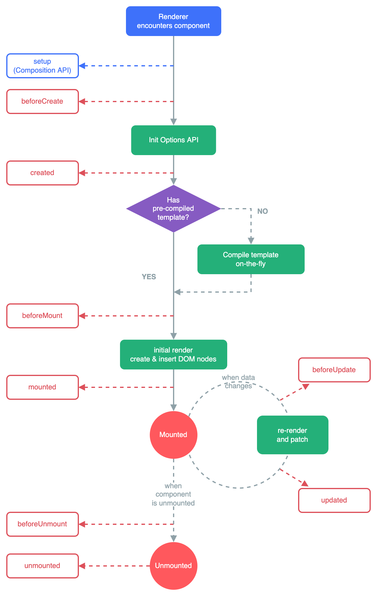
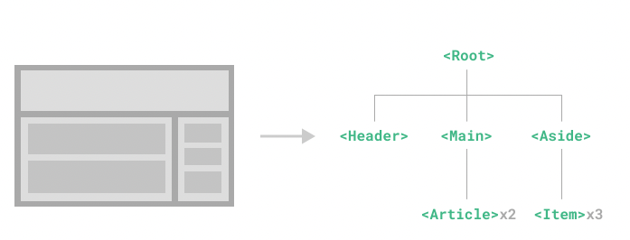

# VUE 3 - ESSENTIALS

## Introduction
#### What is Vue?
Vue (pronounced /vjuː/, like view) is a JavaScript framework for building user interfaces.

#### The Progressive Framework
Vue is a framework and ecosystem that covers most of the common features needed in frontend development.
Depending on your use case, Vue can be used in different ways:
- Enhancing static HTML without a build step
- Embedding as Web Components on any page
- Single-Page Application (SPA)
- Fullstack / Server-Side Rendering (SSR)
- Jamstack / Static Site Generation (SSG)
- Targeting desktop, mobile, WebGL, and even the terminal

#### API Styles
Vue components can be authored in two different API styles: **Options API** and **Composition API**.
**Options API**: 
- Define a component's logic using an object of options such as data, methods, and mounted.
- Properties are exposed on this inside functions, which points to the component instance.

**Composition API**:
- Define a component's logic using imported API functions.
- Composition API is typically used with `<script setup>` (is a hint makes Vue perform compile-time transforms with less boilerplate)

**Which to Choose?**
- Both API styles are fully capable of covering common use cases.
- In fact, the Options API is implemented on top of the Composition API.
- https://vuejs.org/guide/introduction.html#which-to-choose


## Installation
```bash
npm init vue@latest
```

This command will install and execute create-vue, the official Vue project scaffolding tool.
```bash
✔ Project name: … <your-project-name>
✔ Add TypeScript? … No / Yes
✔ Add JSX Support? … No / Yes
✔ Add Vue Router for Single Page Application development? … No / Yes
✔ Add Pinia for state management? … No / Yes
✔ Add Vitest for Unit testing? … No / Yes
✔ Add Cypress for both Unit and End-to-End testing? … No / Yes
✔ Add ESLint for code quality? … No / Yes
✔ Add Prettier for code formatting? … No / Yes

Scaffolding project in ./<your-project-name>...
Done.
```

## Essentials
### Create app
When using Vue without a build step, we can write our root component's template directly inside the mount container:
```html
<div id="app">
  <button @click="count++">{{ count }}</button>
</div>
```

```js
import { createApp } from 'vue'

const app = createApp({
  data() {
    return {
      count: 0
    }
  }
})

app.mount('#app')
```

**Multiple application instances**
Not limited to a single application instance on the same page

```js
const app1 = createApp({
  /* ... */
})
app1.mount('#container-1')

const app2 = createApp({
  /* ... */
})
app2.mount('#container-2')
```

### Template Syntax
**1. Text Interpolation**

Using the "Mustache" syntax (double curly braces):
```html
<span>Message: {{ msg }}</span>
```

**2. Raw HTML**
In order to output real HTML, you will need to use the `v-html` directive:
```html
<p>Using text interpolation: {{ rawHtml }}</p>
<p>Using v-html directive: <span v-html="rawHtml"></span></p>
```
**Note:** you cannot use v-html to compose template partials because Vue is not a string-based templating engine.

**3. Attribute Bindings**
Mustaches cannot be used inside HTML attributes. Instead, use a `v-bind` directive:
```html
<div v-bind:id="dynamicId"></div>
```
If value is null or undefined, the attribute will be removed from the rendered element.

<u>*Shorthand syntax:*</u>

```html
<div :id="dynamicId"></div>
```

<u>*Boolean attributes:*</u>
`v-bind` works a bit differently in this case:

```html
<button :disabled="isButtonDisabled">Button</button>
```

→ The `disabled` attribute will be included if `isButtonDisabled` has a truthy value.

<u>*Dynamically Binding Multiple Attributes*</u>

```js
const objectOfAttrs = {
  id: 'container',
  class: 'wrapper'
}
```
Bind them to a single element by using v-bind without an argument.
```html
<div v-bind="objectOfAttrs"></div>
```

#### **Using JavaScript Expressions**
Vue actually supports the full power of JavaScript expressions inside all data bindings:
```js
{{ number + 1 }}

{{ ok ? 'YES' : 'NO' }}

{{ message.split('').reverse().join('') }}

<div :id="`list-${id}`"></div>
```
In Vue templates, JavaScript expressions can be used in the following positions:
- Inside text interpolations (mustaches)
- In the attribute value of any Vue directives (special attributes that start with `v-`)

<u>Expressions Only</u>
Each binding can only contain **one single expression**.
Therefore, the following will NOT work:

```js
// this is a statement, not an expression:
{{ var a = 1 }}

// flow control won't work either, use ternary expressions
{{ if (ok) { return message } }}
```

<u>Calling Functions</u>
It is possible to call a component-exposed method inside a binding expression:

```html
<span :title="toTitleDate(date)">
  {{ formatDate(date) }}
</span>
```

#### Directives
- Directives are special attributes with the v- prefix.
- Directive attribute values are expected to be single JavaScript expressions (exception of `v-for`, `v-on` and `v-slot`)

**Example:**
```html
<p v-if="seen">Now you see me</p>
```

<u>Arguments</u>
- Some directives can take an "argument"
- By a colon `:` after the directive name
Example:

```html
<a v-bind:href="url"> ... </a>

<!-- shorthand -->
<a :href="url"> ... </a>

```
→ `href` is the argument, tells the `v-bind` directive to bind the element's `href` attribute to the value of the expression url.

Another example is the `v-on` directive:

```html
<a v-on:click="doSomething"> ... </a>

<!-- shorthand -->
<a @click="doSomething"> ... </a>
```

<u>Dynamic Arguments</u>

- Use a JavaScript expression in a directive argument by wrapping it with square brackets
```html
<a v-bind:[attributeName]="url"> ... </a>

<!-- shorthand -->
<a :[attributeName]="url"> ... </a>
```

#### Modifiers
- Modifiers are special postfixes denoted by a dot.
- For example, the .prevent modifier tells the v-on directive to call `event.preventDefault()` on the triggered event:
```html
<form @submit.prevent="onSubmit">...</form>
```

### Reactivity Fundamentals
#### Declaring Reactive State
- Create a reactive object or array with the reactive() function:
```js
import { reactive } from 'vue'

const state = reactive({ count: 0 })

```
- Reactive objects are JavaScript Proxies, behave like normal objects.
- But, Vue is able to track the property access and mutations of a reactive object.
- To use reactive state, declare and return them from a component's `setup()` function.
- Can declare functions that mutate reactive state in the same scope.
  
```js
import { reactive } from 'vue'

export default {
  setup() {
    const state = reactive({ count: 0 })

    function increment() {
      state.count++
    }

    // don't forget to expose the function as well.
    return {
      state,
      increment
    }
  }
}
```

```html
<button @click="increment">
  {{ state.count }}
</button>
```

- Exposing state and methods via `setup()` can be verbose, it is only necessary when not using a build step. 
When using SFCs, we can use:
```html
  <script setup>
  import { reactive } from 'vue'

  const state = reactive({ count: 0 })

  function increment() {
    state.count++
  }
  </script>

  <template>
    <button @click="increment">
      {{ state.count }}
    </button>
  </template>
```

#### DOM Update Timing
- When you mutate reactive state, the DOM is updated automatically.
- DOM updates are not applied synchronously.
- To wait for the DOM update to complete after a state change, you can use the nextTick() global API:
```js
import { nextTick } from 'vue'

function increment() {
  state.count++
  nextTick(() => {
    // access updated DOM
  })
}
```

#### Deep Reactivity
- In Vue, state is deeply reactive by default.
- Changes to be detected even when you mutate nested objects or arrays.

```js
import { reactive } from 'vue'

const obj = reactive({
  nested: { count: 0 },
  arr: ['foo', 'bar']
})

function mutateDeeply() {
  // these will work as expected.
  obj.nested.count++
  obj.arr.push('baz')
}
```

#### Reactive Proxy vs. Original
- `reactive()` is a Proxy of the original object, which is not equal to the original object.
- calling `reactive()` on the same object always returns the same proxy, and, calling `reactive()` on an existing proxy also returns that same proxy.

```js
console.log(reactive(raw) === proxy) // true
console.log(reactive(proxy) === proxy) // true
```

#### Limitations of reactive()
- Only work for object types (objects, arrays, and collection types: Map, Set). Don't work with primitive types such as `string`, `number` or `boolean`.
- We can't easily "replace" a reactive object because the reactivity connection to the first reference is lost.
```js
let state = reactive({ count: 0 })

// the above reference ({ count: 0 }) is no longer being tracked (reactivity connection is lost!)
state = reactive({ count: 1 })
```

- when we assign or destructure a reactive object's property into local variables,  or we pass that property into a function → lose the reactivity connection.
```js
const state = reactive({ count: 0 })

// n is a local variable that is disconnected
// from state.count.
let n = state.count
// does not affect original state
n++

// count is also disconnected from state.count.
let { count } = state
// does not affect original state
count++

// the function receives a plain number and
// won't be able to track changes to state.count
callSomeFunction(state.count)
```

#### Reactive Variables with ref()
- reactive "refs" that can hold any value type.
```js
import { ref } from 'vue'

const count = ref(0)
```

- `ref()` takes the argument and returns it wrapped within a ref object with a `.value` property
- The `.value` property of a ref is reactive.
- A ref containing an object value can reactively replace the entire object.
```js
const objectRef = ref({ count: 0 })

// this works reactively
objectRef.value = { count: 1 }
```
- Refs can also be passed into functions or destructured from plain objects without losing reactivity.
```js
const obj = {
  foo: ref(1),
  bar: ref(2)
}

// the function receives a ref
// it needs to access the value via .value but it
// will retain the reactivity connection
callSomeFunction(obj.foo)

// still reactive
const { foo, bar } = obj
```

- Ref Unwrapping in templates. It means automatically "unwrapped", no need to use .value in templates.
```js
<script setup>
import { ref } from 'vue'

const count = ref(0)

function increment() {
  count.value++
}
</script>

<template>
  <button @click="increment">
    {{ count }}  /// no .value needed
  </button>
</template>
```
- **Note:** the unwrapping only applies if the ref is a top-level property.
```js
const object = { foo: ref(1) }

{{ object.foo + 1 }} /// → Not working as expect
```
  - We can fix that by making foo a top-level property.
```js
const { foo } = object
{{ foo + 1 }}
```

- Ref Unwrapping in Reactive Objects.
```js
const count = ref(0)
const state = reactive({
  count
})

console.log(state.count) // 0

state.count = 1
console.log(count.value) // 1

const otherCount = ref(2)

state.count = otherCount
console.log(state.count) // 2
// original ref is now disconnected from state.count
console.log(count.value) // 1
```
- Ref Unwrapping in Arrays and Collections
```js
const books = reactive([ref('Vue 3 Guide')])
// need .value here
console.log(books[0].value)

const map = reactive(new Map([['count', ref(0)]]))
// need .value here
console.log(map.get('count').value)
```

### Computed Properties
- Putting too much logic in your templates can make them bloated and hard to maintain.
Example:
```js
const author = reactive({
  name: 'John Doe',
  books: [
    'Vue 2 - Advanced Guide',
    'Vue 3 - Basic Guide',
    'Vue 4 - The Mystery'
  ]
})
```
```html
<p>Has published books:</p>
<span>{{ author.books.length > 0 ? 'Yes' : 'No' }}</span>
```

→ for complex logic that includes reactive data, it is recommended to use a computed property. 
Here's the same example, refactored:
```ts
<script setup>
import { reactive, computed } from 'vue'

const author = reactive({
  name: 'John Doe',
  books: [
    'Vue 2 - Advanced Guide',
    'Vue 3 - Basic Guide',
    'Vue 4 - The Mystery'
  ]
})

// a computed ref
const publishedBooksMessage = computed(() => {
  return author.books.length > 0 ? 'Yes' : 'No'
})
</script>

<template>
  <p>Has published books:</p>
  <span>{{ publishedBooksMessage }}</span>
</template>
```
- A computed property automatically tracks its reactive dependencies. 
- the computation of `publishedBooksMessage` depends on `author.books` → it will update `publishedBooksMessage` when `author.books` changes.

#### Computed Caching vs. Methods
- Instead of a computed property, we can define the same function as a method.
- Two approaches are indeed exactly the same.

**Different:** 
- Computed properties are cached based on their reactive dependencies (will only re-evaluate when some of its reactive dependencies have changed).
- A method invocation will always run the function whenever a re-render happens.

#### Writable Computed
- Default, Computed properties are getter-only. 
- Assign new value → receive a runtime warning.
- If you need a "writable" compouted property → create one by providing both  getter and a setter.

```ts
<script setup>
import { ref, computed } from 'vue'

const firstName = ref('John')
const lastName = ref('Doe')

const fullName = computed({
  // getter
  get() {
    return firstName.value + ' ' + lastName.value
  },
  // setter
  set(newValue) {
    // Note: we are using destructuring assignment syntax here.
    [firstName.value, lastName.value] = newValue.split(' ')
  }
})
</script>
```
Now, when assign `fullName.value = 'John Doe'`, the setter will be invoked and firstName and lastName will be updated accordingly.

#### Best Practices
- Getters should be side-effect free.
  - computed getter functions should only perform pure computation and be free of side effects.
  - don't make async requests or mutate the DOM inside a computed getter
- Avoid mutating computed value.

### Class and Style Bindings
#### Binding HTML Classes
##### Binding to Objects

- We can pass an object to `:class` to dynamically toggle classes:
  ```html
  <div :class="{ active: isActive }"></div>
  ```
- We can have multiple classes toggled by having more fields in the object:
  ```js
  const isActive = ref(true)
  const hasError = ref(false)

  <div
    class="static"
    :class="{ active: isActive, 'text-danger': hasError }"
  ></div>
  ```
  OR
  ```js
  const classObject = reactive({
    active: true,
    'text-danger': false
  })

  <div :class="classObject"></div>
  ```
- We can also bind to a computed property that returns an object:
  ```js
  const isActive = ref(true)
  const error = ref(null)

  const classObject = computed(() => ({
    active: isActive.value && !error.value,
    'text-danger': error.value && error.value.type === 'fatal'
  }))

  <div :class="classObject"></div>
  ```

##### Binding to Arrays
- We can bind :class to an array to apply a list of classes:
  ```js
  const activeClass = ref('active')
  const errorClass = ref('text-danger')

  <div :class="[activeClass, errorClass]"></div>
  ```
  Which will render: `class = active text-danger`

##### With Components
- `class` attribute on a component with a single root element → merged with any existing class already on it.

Example:
```html
<!-- child component template -->
<p class="foo bar">Hi!</p>
```
add some classes:
```html
<!-- when using the component -->
<MyComponent class="baz boo" />
```

The rendered HTML will be:
```html
<p class="foo bar baz boo">Hi!</p>
```

- If your component has multiple root elements, using the `$attrs` component property to define which element will receive this class.
```html
<!-- MyComponent template using $attrs -->
<p :class="$attrs.class">Hi!</p>
<span>This is a child component</span>
```
```html
<MyComponent class="baz" />
```

#### Binding Inline Styles
##### Binding to Objects
- `:style` supports binding to JavaScript object values.
```html
<div :style="{ color: activeColor, fontSize: fontSize + 'px' }"></div>
```
- camelCase keys are recommended, :style also supports kebab-cased (font-size).
##### Binding to Arrays
- Same with class
##### Auto-prefixing
- Vue will automatically add the appropriate prefix.
- You can provide an array of multiple (prefixed) values to a style property, for example:
```html
<div :style="{ display: ['-webkit-box', '-ms-flexbox', 'flex'] }"></div>
```
- This will only render the last value in the array which the browser supports.

### Conditional Rendering
#### `v-if`, `v-else`, `v-else-if`
- v-if used to conditionally render a block
- v-else directive to indicate an "else block" for v-if.
- v-else-if serves as an "else if block" for v-if.
Examples:
```html
<h1 v-if="awesome">Vue is awesome!</h1>
```
```html
<div v-if="type === 'A'">
  A
</div>
<div v-else-if="type === 'B'">
  B
</div>
<div v-else-if="type === 'C'">
  C
</div>
<div v-else>
  Not A/B/C
</div>
```
- We can use v-if on a `<template>` element, which serves as an invisible wrapper. 
- The final rendered result will not include the `<template>` element.
```html
<template v-if="ok">
  <h1>Title</h1>
  <p>Paragraph 1</p>
  <p>Paragraph 2</p>
</template>
```

#### `v-show`
- Another option for conditionally displaying an element is the `v-show` directive.
```html
<h1 v-show="ok">Hello!</h1>
```
- `v-show` will always be rendered and remain in the DOM; 
- `v-show` only toggles the display CSS property of the element.
- `v-show` doesn't support the `<template>` element.

#### `v-if` vs `v-show`
- Because `v-if` won't be rendered until the condition becomes true → high toggle costs.
- `v-show` always rendered regardless of initial condition, with CSS-based toggling → high initial render costs.
- prefer `v-show` if toggle something very often and prefer `v-if` if the condition is unlikely to change at runtime.

#### `v-if` with `v-for`
- not recommended to use `v-if` and `v-for` on the same element.
- `v-if` will be evaluated before `v-for`.
- `v-if` condition will not have access to variables from the scope of the `v-for`.
### List Rendering
#### `v-for`
- `v-for` directive to render a list of items based on an array.
  ```js
  const items = ref([{ message: 'Foo' }, { message: 'Bar' }])
  ```
  ```html
  <li v-for="item in items">
    {{ item.message }}
  </li>
  ```
- We can access to all parent scope properties inside `v-for` scope.
  ```js
  const parentMessage = ref('Parent')
  const items = ref([{ message: 'Foo' }, { message: 'Bar' }])
  ```
  ```html
  <li v-for="(item, index) in items">
    {{ parentMessage }} - {{ index }} - {{ item.message }}
  </li>
  ```
- We can use destructuring on the `v-for` item alias.
  ```js
  <li v-for="({ message }, index) in items">
    {{ message }} {{ index }}
  </li>
  ```

- For nested v-for, scoping also works similar to nested functions.
- You can also use `of` as the delimiter instead of `in`.

#### `v-for` with an Object
- You can also use v-for to iterate through the properties of an object. 
  ```js
  const myObject = reactive({
    title: 'How to do lists in Vue',
    author: 'Jane Doe',
    publishedAt: '2016-04-10'
  })
  ```
  ```html
  <li v-for="(value, key, index) in myObject">
    {{ index }}. {{ key }}: {{ value }}
  </li>
  ```

#### `v-for` with a Range
  ```html
  <span v-for="n in 10">{{ n }}</span>
  ```
  Note here n starts with an initial value of 1 instead of 0.

#### `v-for` on `<template>`
- To render a block of multiple elements
```html
<ul>
  <template v-for="item in items">
    <li>{{ item.msg }}</li>
    <li class="divider" role="presentation"></li>
  </template>
</ul>
```

#### Maintaining State with `key`
- You need to provide a unique key attribute for each item.
```html
<div v-for="item in items" :key="item.id">
  <!-- content -->
</div>
```
- When using `<template v-for>`, the key should be placed on the `<template>` container.
- The key binding expects primitive values - i.e. strings and numbers. 

#### `v-for` with a Component
- You can directly use v-for on a component, like any normal element (don't forget to provide a key).
- But, it's not pass any data to the component. In order to pass the iterated data into the component, we should also use props:
```html
<MyComponent
  v-for="(item, index) in items"
  :item="item"
  :index="index"
  :key="item.id"
/>
```

#### Array Change Detection
#### Displaying Filtered/Sorted Results
- Display a filtered or sorted version of an array without actually mutating or resetting the original data.
```js
const numbers = ref([1, 2, 3, 4, 5])

const evenNumbers = computed(() => {
  return numbers.value.filter((n) => n % 2 === 0)
})
```
```html
<li v-for="n in evenNumbers">{{ n }}</li>
```
- In situations where computed properties are not feasible (inside nested `v-for`):
```js
const sets = ref([
  [1, 2, 3, 4, 5],
  [6, 7, 8, 9, 10]
])

function even(numbers) {
  return numbers.filter((number) => number % 2 === 0)
}
```
```html
<ul v-for="numbers in sets">
  <li v-for="n in even(numbers)">{{ n }}</li>
</ul>
```
- Be careful with reverse() and sort() in a computed property! It will mutate the original array. Please create a copy of the original array before calling these methods:
```js
- return numbers.reverse()
+ return [...numbers].reverse()
```

### Event Handling
#### Listening to Events
- Use the v-on directive (or shorter with @ symbol), ex: `v-on:click="handler"` or `@click="handler"`.
- The handler value can be one of the following:
  - Inline handlers
  - Method handlers

#### Inline Handlers
```js
<button @click="count++">Add 1</button>
<p>Count is: {{ count }}</p>
```
#### Method Handlers
- `v-on` can also accept the name or path of a component method you'd like to call.
```js
const name = ref('Vue.js')

function greet(event) {
  alert(`Hello ${name.value}!`)
  // `event` is the native DOM event
  if (event) {
    alert(event.target.tagName)
  }
}
```
```html
<!-- `greet` is the name of the method defined above -->
<button @click="greet">Greet</button>
```
#### Calling Methods in Inline Handlers
```js
function say(message) {
  alert(message)
}

<button @click="say('hello')">Say hello</button>
<button @click="say('bye')">Say bye</button>
```
#### Accessing Event Argument in Inline Handlers
```html
<!-- using $event special variable -->
<button @click="warn('Form cannot be submitted yet.', $event)">
  Submit
</button>

<!-- using inline arrow function -->
<button @click="(event) => warn('Form cannot be submitted yet.', event)">
  Submit
</button>
```
```js
function warn(message, event) {
  // now we have access to the native event
  if (event) {
    event.preventDefault()
  }
  alert(message)
}
```
#### Event Modifiers
- Vue provides event modifiers for v-on.
- Recall that modifiers are directive postfixes denoted by a dot.
  - .stop
  - .prevent
  - .self
  - .capture
  - .once
  - .passive

```html
<!-- the click event's propagation will be stopped -->
<a @click.stop="doThis"></a>

<!-- the submit event will no longer reload the page -->
<form @submit.prevent="onSubmit"></form>

<!-- modifiers can be chained -->
<a @click.stop.prevent="doThat"></a>

<!-- just the modifier -->
<form @submit.prevent></form>

<!-- only trigger handler if event.target is the element itself -->
<!-- i.e. not from a child element -->
<div @click.self="doThat">...</div>
```

- `@click.prevent.self`: prevent click's default action on the element itself and its children.
- `@click.self.prevent` will only prevent click's default action on the element itself.

#### Key Modifiers
```html
<!-- only call `submit` when the `key` is `Enter` -->
<input @keyup.enter="submit" />
```
- Still work with kebab-case.
```html
<input @keyup.page-down="onPageDown" />
```

**Key Aliases**
- .enter
- .tab
- .delete (captures both "Delete" and "Backspace" keys)
- .esc
- .space
- .up
- .down
- .left
- .right

**System Modifier Keys**
- .ctrl
- .alt
- .shift
- .meta

```html
<!-- Alt + Enter -->
<input @keyup.alt.enter="clear" />

<!-- Ctrl + Click -->
<div @click.ctrl="doSomething">Do something</div>
```
#### Mouse Button Modifiers
- .left
- .right
- .middle
These modifiers restrict the handler to events triggered by a specific mouse button.

For more: https://vuejs.org/guide/essentials/event-handling.html#key-modifiers 


### Form Input Bindings
- `v-model` directive:
```html
<input v-model="text">
```
It's a shorten of:
```html
<input
  :value="text"
  @input="event => text = event.target.value">
```
- `<input>` with text types and `<textarea> ` elements use `value` property and input event;
- `<input type="checkbox">` and `<input type="radio">` use `checked` property and change event;
- `<select>` use value as a prop and `change` as an event.

`v-model` will ignore the initial value, checked or selected attributes found on any form elements.

**Some examples:**
Input, TextArea
```html
<p>Message is: {{ message }}</p>
<input v-model="message" placeholder="edit me" />
```
```html
<span>Multiline message is:</span>
<p style="white-space: pre-line;">{{ message }}</p>
<textarea v-model="message" placeholder="add multiple lines"></textarea>
```
Checkbox
```html
<input type="checkbox" id="checkbox" v-model="checked" />
<label for="checkbox">{{ checked }}</label>
```

```html
const checkedNames = ref([])
<div>Checked names: {{ checkedNames }}</div>

<input type="checkbox" id="jack" value="Jack" v-model="checkedNames">
<label for="jack">Jack</label>

<input type="checkbox" id="john" value="John" v-model="checkedNames">
<label for="john">John</label>

<input type="checkbox" id="mike" value="Mike" v-model="checkedNames">
<label for="mike">Mike</label>
```

Radio
```html
<div>Picked: {{ picked }}</div>

<input type="radio" id="one" value="One" v-model="picked" />
<label for="one">One</label>

<input type="radio" id="two" value="Two" v-model="picked" />
<label for="two">Two</label>
```
Select
```html
<div>Selected: {{ selected }}</div>

<select v-model="selected">
  <option disabled value="">Please select one</option>
  <option>A</option>
  <option>B</option>
  <option>C</option>
</select>
```

Select options can be dynamically rendered with `v-for`:

```html
<select v-model="selected">
  <option v-for="option in options" :value="option.value">
    {{ option.text }}
  </option>
</select>

<div>Selected: {{ selected }}</div>
```
#### Value Bindings
- For radio, checkbox and select options, the `v-model` binding values are usually static strings (or booleans for checkbox).
```html
<!-- `picked` is a string "a" when checked -->
<input type="radio" v-model="picked" value="a" />

<!-- `toggle` is either true or false -->
<input type="checkbox" v-model="toggle" />

<!-- `selected` is a string "abc" when the first option is selected -->
<select v-model="selected">
  <option value="abc">ABC</option>
</select>
```
**Checkbox**
```html
<input
  type="checkbox"
  v-model="toggle"
  true-value="yes"
  false-value="no" />
```
- `true-value` and `false-value` only work with `v-modal`, not affect the input's `value` atrribute.
- You can also bind them to dynamic values using `v-bind`:
```html
<input
  type="checkbox"
  v-model="toggle"
  :true-value="dynamicTrueValue"
  :false-value="dynamicFalseValue" />
```
**Radio**
```html
<input type="radio" v-model="pick" :value="first" />
<input type="radio" v-model="pick" :value="second" />
```

**Select Options**
```html
<select v-model="selected">
  <!-- inline object literal -->
  <option :value="{ number: 123 }">123</option>
</select>
```
→ `v-model` supports value bindings of non-string values as well.

#### Modifiers:
- .lazy
  ```html
  <!-- synced after "change" instead of "input" -->
  <input v-model.lazy="msg" />
  ```
- .number
  ```html
  <input v-model.number="age" />
  ```
  If the value cannot be parsed with `parseFloat()`, then the original value is used instead.
- .trim
  ```html
  <input v-model.trim="msg" />
  ```
  → whitespace from user input to be trimmed automatically.

### Lifecycle Hooks
#### Registering Lifecycle Hooks
- `onMounted` hook can be used to run code after the component has finished the initial rendering and created the DOM nodes.
- It's registered **synchronously** during component setup.

#### Lifecycle Diagram



### Watchers
- We can use the watch function to trigger a callback whenever a piece of reactive state changes.
```html
<script setup>
import { ref, watch } from 'vue'

const question = ref('')
const answer = ref('Questions usually contain a question mark. ;-)')

// watch works directly on a ref
watch(question, async (newQuestion, oldQuestion) => {
  if (newQuestion.indexOf('?') > -1) {
    answer.value = 'Thinking...'
    try {
      const res = await fetch('https://yesno.wtf/api')
      answer.value = (await res.json()).answer
    } catch (error) {
      answer.value = 'Error! Could not reach the API. ' + error
    }
  }
})
</script>

<template>
  <p>
    Ask a yes/no question:
    <input v-model="question" />
  </p>
  <p>{{ answer }}</p>
</template>
```

#### Watch Source Types
- First argument can be a ref, a reactive object, a getter function, or an array of multiple sources.
```js
const x = ref(0)
const y = ref(0)

// single ref
watch(x, (newX) => {
  console.log(`x is ${newX}`)
})

// getter
watch(
  () => x.value + y.value,
  (sum) => {
    console.log(`sum of x + y is: ${sum}`)
  }
)

// array of multiple sources
watch([x, () => y.value], ([newX, newY]) => {
  console.log(`x is ${newX} and y is ${newY}`)
})
```
- can't watch a property of a reactive object, instead, use a getter:
```js
// instead, use a getter:
watch(
  () => obj.count,
  (count) => {
    console.log(`count is: ${count}`)
  }
)
```

- Deep Watchers: https://vuejs.org/guide/essentials/watchers.html#deep-watchers 

#### Eager Watchers
- We can force a watcher's callback to be executed immediately by passing the `immediate: true ` option:
```js
watch(source, (newValue, oldValue) => {
  // executed immediately, then again when `source` changes
}, { immediate: true })
```

#### watchEffect()
- `watchEffect()` allows us to track the callback's reactive dependencies automatically.
Example:
```js
watchEffect(async () => {
  const response = await fetch(
    `https://jsonplaceholder.typicode.com/todos/${todoId.value}`
  )
  data.value = await response.json()
})
```

- The callback will run immediately, there's no need to specify `immediate: true`.
- Whenever todoId.value changes, the callback will be run again.
- With watchEffect(), we no longer need to pass todoId explicitly as the source value.

#### Callback Flush Timing
- By default, user-created watcher callbacks are called before Vue component updates.
- If you want to access the DOM in a watcher callback after Vue has updated it, you need to specify the flush: 'post' option:
```js
watch(source, callback, {
  flush: 'post'
})

watchEffect(callback, {
  flush: 'post'
})
```
- Post-flush `watchEffect()` also has a convenience alias, `watchPostEffect()`:
```js
import { watchPostEffect } from 'vue'

watchPostEffect(() => {
  /* executed after Vue updates */
})
```

#### Stopping a Watcher
- Watcher automatically stopped when the owner component is unmounted.
- If the watcher is created in an async callback, it won't be bound to the owner component and must be stopped manually to avoid memory leaks.

```js
<script setup>
import { watchEffect } from 'vue'

// this one will be automatically stopped
watchEffect(() => {})

// ...this one will not!
setTimeout(() => {
  watchEffect(() => {})
}, 100)
</script>
```
- Unwatch: This works for both `watch` and `watchEffect`:
```js
const unwatch = watchEffect(() => {})

// ...later, when no longer needed
unwatch()
```

### Template Refs
- Direct access to the underlying DOM elements.
- Use the special ref attribute
```js
<input ref="input">
```

#### Accessing the Refs
- we need to declare a ref with the same name:
```ts
<script setup>
import { ref, onMounted } from 'vue'

// declare a ref to hold the element reference
// the name must match template ref value
const input = ref(null)

onMounted(() => {
  input.value.focus()
})
</script>

<template>
  <input ref="input" />
</template>
```
- If not using `<script setup>`, make sure to also return the ref from `setup()`
- you can only access the ref after the component is `mounted`, the value is `null` on the first render.
#### Refs inside v-for
```ts
<script setup>
import { ref, onMounted } from 'vue'

const list = ref([
  /* ... */
])

const itemRefs = ref([])

onMounted(() => console.log(itemRefs.value))
</script>

<template>
  <ul>
    <li v-for="item in list" ref="itemRefs">
      {{ item }}
    </li>
  </ul>
</template>
```
- the ref array does **not** guarantee the same order as the source array.
#### Function Refs
- Using a dynamic `:ref` binding so we can pass it a function instead of a ref name string.

#### Ref on Component
```ts
<script setup>
import { ref, onMounted } from 'vue'
import Child from './Child.vue'

const child = ref(null)

onMounted(() => {
  // child.value will hold an instance of <Child />
})
</script>

<template>
  <Child ref="child" />
</template>
```
- Parent component will have full access to every property and method of the child component.
- Component refs should be only used when absolutely needed, should implement parent / child interactions using the standard props and emit interfaces first.

### Components Basics
- split the UI into independent and reusable pieces.

#### Defining a Component
- With build step, define each Vue component in a dedicated file using the .vue extension - Single-File Component (SFC).
```ts
<script setup>
import { ref } from 'vue'

const count = ref(0)
</script>

<template>
  <button @click="count++">You clicked me {{ count }} times.</button>
</template>
```

- Not using build step, component can be defined as a plain JS object containing Vue-specific options.
```ts
import { ref } from 'vue'

export default {
  setup() {
    const count = ref(0)
    return { count }
  },
  template: `
    <button @click="count++">
      You clicked me {{ count }} times.
    </button>`
  // or `template: '#my-template-element'`
}
```
#### Using a Component
- To use a child component, import it in the parent component.
```ts
<script setup>
import ButtonCounter from './ButtonCounter.vue'
</script>

<template>
  <h1>Here is a child component!</h1>
  <ButtonCounter />
</template>
```
- It's also possible to globally register a component, making it available to all components without having to import it.
-  Each time you use a component, a new **instance** of it is created.
-  In SFCs, it's recommended to use **PascalCase** tag names.
-  If you are authoring your templates directly in a DOM, you will need to use kebab-case and explicit closing tags for components.
#### Passing Props
- Props are custom attributes you can register on a component.
- Must declare in the list of props this component accepts, using the `defineProps` macro.
```ts
// BlogPost.vue
<script setup>
defineProps(['title'])
</script>

<template>
  <h4>{{ title }}</h4>
</template>
```

- `defineProps` is a compile-time macro that is only available inside `<script setup>`.
- no need to be explicitly imported.
- `defineProps` also returns an object that contains all the props passed to the component.
```js
const props = defineProps(['title'])
console.log(props.title)
```
- If you are not using `<script setup>`:
```ts
export default {
  props: ['title'],
  setup(props) {
    console.log(props.title)
  }
}
```

- You want to render a component for each one, using v-for:
```html
<BlogPost
  v-for="post in posts"
  :key="post.id"
  :title="post.title"
 />
```

#### Listening to Events
```html
<BlogPost
  ...
  @enlarge-text="postFontSize += 0.1"
 />
```
- The child component can emit an event on itself by calling the built-in `$emit` method, passing the name of the event:
```html
<!-- BlogPost.vue, omitting <script> -->
<template>
  <div class="blog-post">
    <h4>{{ title }}</h4>
    <button @click="$emit('enlarge-text')">Enlarge text</button>
  </div>
</template>
```
- We can optionally declare emitted events using the `defineEmits` macro:
```ts
//  BlogPost.vue
<script setup>
defineProps(['title'])
defineEmits(['enlarge-text'])
</script>
```
- If you are not using `<script setup>`:
```ts
export default {
  emits: ['enlarge-text'],
  setup(props, ctx) {
    ctx.emit('enlarge-text')
  }
}
```

#### Content Distribution with Slots
- Useful to be able to pass content to a component.
Example:
```html
<AlertBox>
  Something bad happened.
</AlertBox>
```
This can be achieved using Vue's custom `<slot>` element:
```html
<template>
  <div class="alert-box">
    <strong>This is an Error for Demo Purposes</strong>
    <slot />
  </div>
</template>

<style scoped>
.alert-box {
  /* ... */
}
</style>
```

#### Dynamic Components
```html
<!-- Component changes when currentTab changes -->
<component :is="tabs[currentTab]"></component>
``` 
The value passed to :is can contain either:
- the name string of a registered component, OR
- the actual imported component object

When switching between multiple components with `<component :is="...">`, component will be unmounted.
We can force the inactive components to stay "alive" with the built-in `<KeepAlive>` component.
#### DOM Template Parsing Caveats
More: https://vuejs.org/guide/essentials/component-basics.html#dom-template-parsing-caveats 