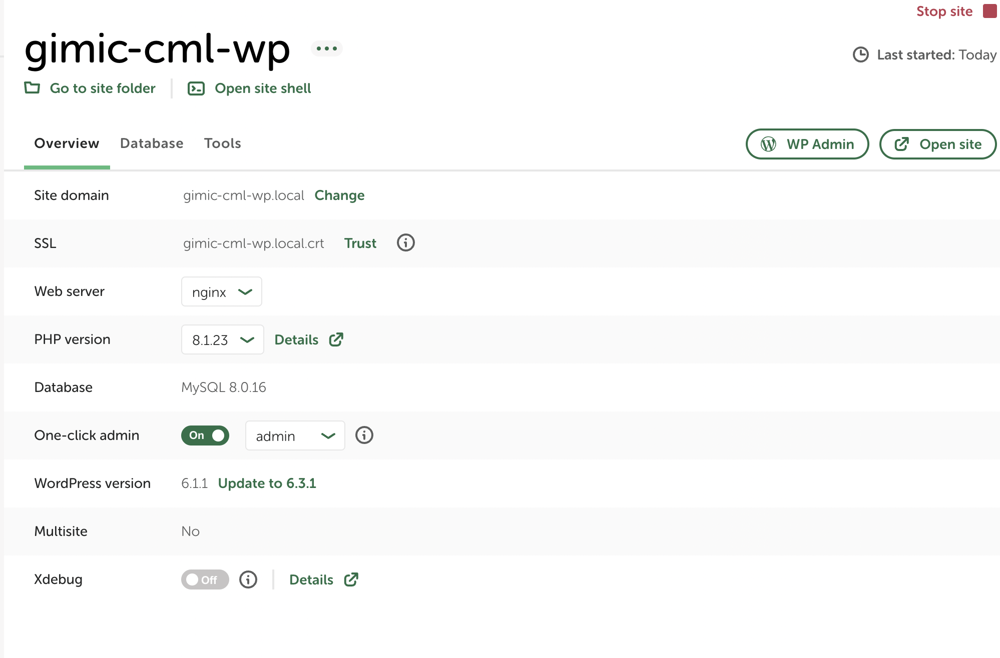

  


Please follow these steps:

### 1. Download Local App

[Localwp](https://localwp.com/) - `local Wordpress development tool`

### 2. Clone and zip repository
```bash
git clone git@github.com:ExecutionLab/gimic-cml-wp.git
```
Compress the source to `zip` file.

### 3. Import to Local
- Open `localwp` app
- Select `select an existing ZIP or drag your file into the window to import a site` → choose your `zip` file.
- Enter `local site name`
- Evironment `Prefered` → Import site

Wait for starting up services

Some information in `Overview` tab:
- **Site domain**: local domain to access your web
- **On-click admin:** recommend to turn on (auto login everytime access to admin site)

### 4. Install packages
- Change dir to `cml-theme` folder
```
app > public > wp-content > themes > cml-theme
```

- Run `yarn` to install packages (tailwind, swiper,...)
- **Note:** to work with CSS, run `yarn build-css` to watch changing files and build to destination style file.

### 5. Some Configs
**1. Database**
- Open `localwp`
- Select tab `Database`
- Open `Adminer`
- Click `Select` table `wp_options`. Make sure:
  - option `siteurl` and `home` is same with site domain
  - In case difference, please `edit`.


**2. Admin**




- Open `Admin site` (click `Wp Admin` on the right screen `local`)
- Select `Plugin` → activate all (exclude plugins relate to Email)

Now, you can access `wp site` by clicking `Open Site`

**3. Contact Form**

- Add `define('WPCF7_AUTOP', false);` to `wp-config.php`
- On Admin site, Create new page `contact`
- Add short code block:
```
[contact-form-7 id="46" title="お問い合わせ(Inquiry form)" html_id="form-inquiry" html_class="form-inquiry-container app-container"]
```
- Publish page
- Go to `Contact` → edit `Contact form` and replace this code:
```html
<div class="heading-inquiry-form">
    <h1 class="title-inquiry-form">お問い合わせ</h1>
    <p class="desc-inquiry-form">クリニック未来ラボに関するお問い合わせは、下記の入力フォームよりお願いいたします。</p>
    <p class="desc-inquiry-form margin-none"> ご入力いただく情報は、<br class='br-mobile' />お問い合わせの回答を目的として使用します。</p>
</div>
<div class="content-inquiry-form">
    <div class="input-field-inquiry">
        <label for="username" class="label-inquiry-input">お名前 <span class="label-note">(必須)</span></label>
        [text* username id:username class:input-inquiry-text placeholder "お名前を入力してください"]
    </div>
    <div class="input-field-inquiry">
        <label for="" class="label-inquiry-input">メールアドレス <span class="label-note">(必須)</span></label>
        [email* email id:email_id class:input-inquiry-text placeholder "メールアドレスを入力してください"]
    </div>
    <div class="input-field-inquiry">
        <label for="confirmEmail" class="label-inquiry-input">メールアドレス確認用 <span class="label-note">(必須)</span></label>
        [email* confirmEmail id:confirmEmail class:input-inquiry-text placeholder "メールアドレス確認用を入力してください"]
    </div>
    <div class="input-field-inquiry">
        <label for="phone" class="label-inquiry-input">電話番号</label>
        [tel phone minlength:10 maxlength:11 id:phone class:input-inquiry-text placeholder "電話番号ハイフンなしで入力してください"]
    </div>
    <div class="input-field-inquiry">
        <label for="content" class="label-inquiry-input">お問い合わせ内容 <span class="label-note">(必須)</span></label>
        [textarea* content class:textarea-inquiry-text maxlength:1000 placeholder "1000文字以内で入力してください"]
    </div>
</div>
<div class="policy-inquiry-form">
    [checkbox* accept_policy class:checkbox-inquiry-form use_label_element "1"]
    <span class="policy-text-inquiry-form">
        <a href="https://www.gimic.co.jp/privacy-1" class="policy-link-inquiry-form" target="_blank">「個人情報保護方針・個人情報取り扱い」</a>に同意する
    </span>
</div>
[submit class:btn-inquiry-form id:form-submit "上記内容で送信する"]
```


